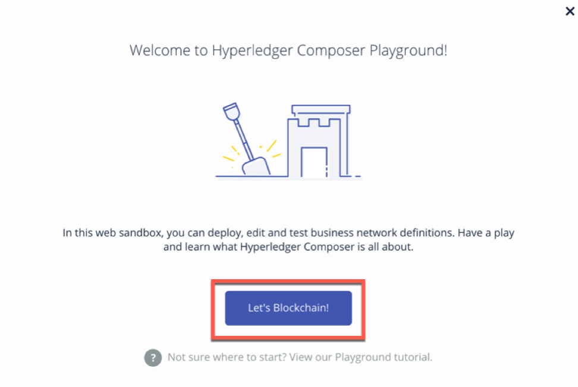
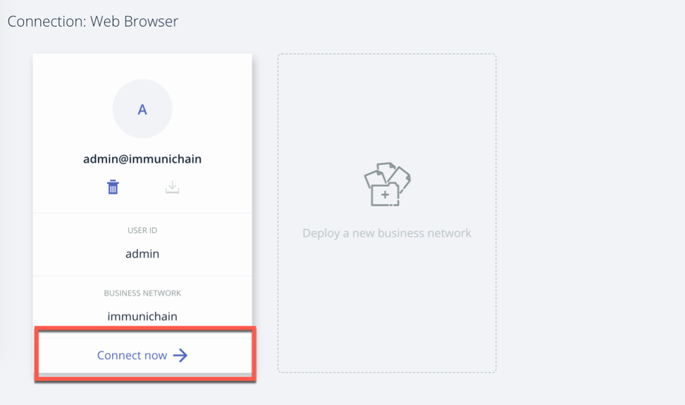

Part 1: Web Immunichain
=======================

**1.** Go to your http://composer-playground.mybluemix.net within a browser. Google Chrome is preferred, but Firefox works just as well::

	http://composer-playground.mybluemix.net

**2.** You will get a Welcome pop-up box with a graphic and a few words. Click on Let’s Blockchain

**3.** Then you will be in the Composer Playground homepage. Click on Deploy a New Business Network. Make sure it says Web Browser in the top right.

**4.** Select empty-business-network. Then give your business network a name and a description. 

  - Select: empty-business-network
  - Business Network Name: immunichain
  - Description: tracking of immunization records

**5.** Then click on Deploy 

Afterwards, you can come back to the Composer Playground play with some of the other sample business network applications, like animal tracking or vehicle lifecycles.

**6.** You will then be taken to Your Wallet. Your wallet is basically a quick, seamless connection to multiple connections that you can jump around with. You will see later how easy it is. Click on Connect now in order to get connected to our immunichain network

**7.** Fill in your model file with the below text::

  /* Immunization definitions */

  namespace ibm.wsc.immunichain

  participant Guardian identified by gid {
	o String gid
	o String name
  }

  participant MedProvider identified by medid {
	o String medid
	o String name
  }

  abstract concept immunization {
	o String name
	o String provider
	o String imdate
  }

  concept immunirecord extends immunization {}

  asset Childform identified by cid {
	o String cid
	o String name
	o String address
	--> Guardian guardian
	o String dob
	--> MedProvider [] medproviders optional
	o immunirecord [] immunizations
  }
 
  transaction assignMedProvider {
	--> Guardian guardian
	--> MedProvider medprovider
	--> Childform childform
  }

  transaction authMember {
	--> Guardian guardian
	--> Childform childform
  }

  transaction removeMemberAuth {
	--> Guardian guardian
	--> Childform childform
  }

  transaction addImmunizations {
	o immunirecord [] vaccines
	--> Childform childform
  }

  transaction updateChildForm {
	o String name optional
	o String address optional
	--> Childform childform
  }

  transaction reassignGuardian {
  --> Guardian oldguardian
  --> Guardian newguardian
	--> Childform childform
  }

**8.** Then click on Add a File in the bottom left. Then select Script File (.js) and click on Add. 

.. image:: Images/3.6.png

**9.** Replace the content of the Script file with the following below::

  'use strict';

  /**
 	* Add medical provider to child record
  * @param {ibm.wsc.immunichain.assignMedProvider} assignMedProvider - the assignMedProvider transaction
 	* @transaction
 	*/
  function assignMedProvider(assignMedProvider) {
  	var guardian = assignMedProvider.guardian;
  	var child = assignMedProvider.childform;
  	var medprovider = assignMedProvider.medprovider;
  	child.medproviders.push(medprovider);
  
  	return getAssetRegistry('ibm.wsc.immunichain.Childform')
   	.then(function(result) {
    	return result.update(child);
  	});
  }

  /**
 	* Add immunization(s) to child record
  * @param {ibm.wsc.immunichain.addImmunizations} addImmunizations - the addImmunizations transaction
 	* @transaction
 	*/
  function addImmunizations(addImmunizations){
	var vaccines = addImmunizations.vaccines;
	var child = addImmunizations.childform;
 	var immunizations = child.immunizations;
  /*  	if (immunizations[0].name == 'default'){
    	immunizations.splice(0,1) 
    	} */
  	immunizations.push.apply(immunizations,vaccines);
  
	return getAssetRegistry('ibm.wsc.immunichain.Childform')
		.then(function(ChildRegistry){
			//save the childform
			return ChildRegistry.update(child);
		});
  }

  /**
  * Update information on child record, can only be done by guardian
  * @param {ibm.wsc.immunichain.updateChildForm} updateChildForm - the updateChildForm transaction
 	* @transaction
 	*/
  function updateChildForm(updateChildForm){
  	var newaddress = null;
  	var newname = null;
    	var child = updateChildForm.childform;
  	newaddress = updateChildForm.address;
  	newname = updateChildForm.name;
  
  	if (newaddress != null && newname != null){
    	child.name = newname;
      	child.address = newaddress;
    	}
  	else if (newaddress != null){
    	child.address = newaddress;
    	}
 	else if (newname != null){
    	child.name = newname;
    	}
	return getAssetRegistry('ibm.wsc.immunichain.Childform')
		.then(function(ChildRegistry){
			//save the childform
			return ChildRegistry.update(child);
		});
  }

  /**
 	* Assign child to his/herself when he/she is of legal age
  * @param {ibm.wsc.immunichain.reassignGuardian} reassignGuardian - the reassignGuardian transaction
  * @transaction
 	*/
  function reassignGuardian(reassignGuardian) {
  	var oldguardian = reassignGuardian.oldguardian;
  	var newguardian = reassignGuardian.newguardian;
  	var child = reassignGuardian.childform;
  	child.guardian = newguardian;
  
  	return getAssetRegistry('ibm.wsc.immunichain.Childform')
    	.then(function(result) {
    	return result.update(child);
  	});
  }

  /**
 	* Get the immunizations for a child
 	* @query
 	* @param {String} cid - the unique id assigned to the childform
 	* @returns {immunirecord[]} - the immunizations that the child has gotten
  */
  function listImmunizations(cid) {
  	return query('select x.immunizations from Childform where x.cid ==: cid');
  }

**10.** Then click on Deploy Changes in the bottom left. 

.. image:: Images/3.7.png

In 0.19.0, they changed Update to Deploy Changes. Even in the Bluemix version of Composer, you are deploying this network to Fabric. When you hit the Deploy Changes button, you have to give that chaincode a version, but it has to go in sequential order. For example, 0.0.1 would move to 0.0.2 – thus cannot go from 0.0.1 to 0.0.3. If you were not to rename your chaincode version, the deploy-0 to deploy-1 would also work due to the sequential requirement. 

**11.** After you have done that, your screen should look like this. If it does, then we are in business (get it? In business, business network – great!)

.. image:: Images/3.8.png

Part 2: Creating Assets and Participants
========================================

**1.** Now that you have an Immunichain Business Network, jump over to the Test section of the Composer Playground. The test area allows you to create assets, participants and submit transactions against your assets and participants. Your screen should look like this: 

.. image:: Images/4.1.png

Before we create assets and participants, we need to know what each asset and participants represent. 
	- Guardian is the parent
	- MedProvider is simply a medical provider, like a doctor
	- Childform is simply the child or the asset in this business network

**2.** Now create a Guardian by clicking on +Create New Participant. Give the Guardian a number. I stick to 1, 2, 3 or low numbers that you can remember, but you can create any ID number you want. I suggest writing your ID numbers down as we move along. Once you have filled in the information click on Create

.. image:: Images/4.2.png

**3.** Once you have created a Guardian, your screen should look like this: 

.. image:: Images/4.4.png

**4.** Go ahead and make a Medical Provider. Remember the Medical Provider number you create

.. image:: Images/4.5.png

**5.** Now, let’s make a child. Click on optional properties at the bottom first. Assign him to the guardian you just created a step ago

**6.** Your screen should look like this when you are done:

**7.** Go ahead and create more medical providers, guardians and children. Just to remember to write down the ID numbers. This will make more sense when we submit transactions. 

Part 3: Submitting Transactions
===============================

**1.** Now, click on Submit Transaction in the bottom left and let’s authorize a member to view the health record of our child. You can change the type of transaction you want by click on the middle grey box. I have it in a square below

.. image:: Images/5.1.png

**2.** Now, let’s make an authorized medical provider transaction. Here is my transaction. You can make any type of transaction you want here

My transaction says let medical provider #1 (HealthQuest) have Child #1’s (Emily) healthcare record. This also means that HealthQuest can administer immunization shots to Emily.

**3.** You can view this transaction by clicking on childform on the left and then Show All on Emily. Notice that member 1 is now in Emily’s description

.. image:: Images/5.3.png

**4.** Click on Submit Transaction and then change the transaction type to addImmunizations. The format to add an immunization is a little different. In the Vaccine section put { "name" : "immunization", "provider" : "medical provider", "imdate" : "date" } inbetween the brackets. Replace the immunization, medical provider and date with whatever you would like. Here is what my transaction looks like::

{ "name" : "immunization", "provider" : "medical provider", "imdate" : "date" }

**5.** To view your immunization, go your child in the Childform section

**6.** Once you submit the transaction and it is good, click on All Transactions in the bottom left. This is what Composer likes to call the Historian. Now is a good time to tell you about the Historian. The Historian is the sequence of transactions or addition or removal of participants or assets. I didn’t tell you to look at the Historian when you were creating the Participants and Assets, but the Historian kept track of when and what type of participant or asset you created. You can scroll to the bottom to view the first transaction you created, which should be the Medical Provider - HealthQuest - or whatever you called it. You can see by clicking on view record. 

**7.** Continue to make various transactions that you want

