Part 1: Web Immunichain
=======================

**1.** Go to your http://composer-playground.mybluemix.net within a browser. Google Chrome is preferred, but Firefox works just as well::

	http://composer-playground.mybluemix.net

**2.** You will get a Welcome pop-up box with a graphic and a few words. Click on Let’s Blockchain

.. image:: Images/3.1.png

**3.** Then you will be in the Composer Playground homepage. Click on Deploy a New Business Network. Make sure it says Web Browser in the top right.

.. image:: Images/3.2.Web.png

**4.** Select empty-business-network. Then give your business network a name and a description:: 

	Select: empty-business-network
	Business Network Name: immunichain
	Description: tracking of immunization records

**5.** Then click on Deploy 

Afterwards, you can come back to the Composer Playground play with some of the other sample business network applications, like animal tracking or vehicle lifecycles.

**6.** You will then be taken to Your Wallet. Your wallet is basically a quick, seamless connection to multiple connections that you can jump around with. You will see later how easy it is. Click on Connect now in order to get connected to our immunichain network

.. image:: Images/3.5.png

**7.** Fill in your model file with the below text::

  /* Immunization definitions */

  namespace ibm.wsc.immunichain

  participant Guardian identified by gid {
	o String gid
	o String name
  }

  participant MedProvider identified by medid {
	o String medid
	o String name
  }

  abstract concept immunization {
	o String name
	o String provider
	o String imdate
  }

  concept immunirecord extends immunization {}

  asset Childform identified by cid {
	o String cid
	o String name
	o String address
	--> Guardian guardian
	o String dob
	--> MedProvider [] medproviders optional
	o immunirecord [] immunizations
  }
 
  transaction assignMedProvider {
	--> Guardian guardian
	--> MedProvider medprovider
	--> Childform childform
  }

  transaction authMember {
	--> Guardian guardian
	--> Childform childform
  }

  transaction removeMemberAuth {
	--> Guardian guardian
	--> Childform childform
  }

  transaction addImmunizations {
	o immunirecord [] vaccines
	--> Childform childform
  }

  transaction updateChildForm {
	o String name optional
	o String address optional
	--> Childform childform
  }

  transaction reassignGuardian {
  --> Guardian oldguardian
  --> Guardian newguardian
	--> Childform childform
  }

**8.** Then click on Add a File in the bottom left. Then select Script File (.js) and click on Add. 

.. image:: Images/3.6.png

**9.** Replace the content of the Script file with the following below::

  'use strict';

  /**
 	* Add medical provider to child record
  * @param {ibm.wsc.immunichain.assignMedProvider} assignMedProvider - the assignMedProvider transaction
 	* @transaction
 	*/
  function assignMedProvider(assignMedProvider) {
  	var guardian = assignMedProvider.guardian;
  	var child = assignMedProvider.childform;
  	var medprovider = assignMedProvider.medprovider;
  	child.medproviders.push(medprovider);
  
  	return getAssetRegistry('ibm.wsc.immunichain.Childform')
   	.then(function(result) {
    	return result.update(child);
  	});
  }

  /**
 	* Add immunization(s) to child record
  * @param {ibm.wsc.immunichain.addImmunizations} addImmunizations - the addImmunizations transaction
 	* @transaction
 	*/
  function addImmunizations(addImmunizations){
	var vaccines = addImmunizations.vaccines;
	var child = addImmunizations.childform;
 	var immunizations = child.immunizations;
  /*  	if (immunizations[0].name == 'default'){
    	immunizations.splice(0,1) 
    	} */
  	immunizations.push.apply(immunizations,vaccines);
  
	return getAssetRegistry('ibm.wsc.immunichain.Childform')
		.then(function(ChildRegistry){
			//save the childform
			return ChildRegistry.update(child);
		});
  }

  /**
 	* Update information on child record, can only be done by guardian
  * @param {ibm.wsc.immunichain.updateChildForm} updateChildForm - the updateChildForm transaction
 	* @transaction
 	*/
  function updateChildForm(updateChildForm){
  	var newaddress = null;
  	var newname = null;
    	var child = updateChildForm.childform;
  	newaddress = updateChildForm.address;
  	newname = updateChildForm.name;
  
  	if (newaddress != null && newname != null){
    	child.name = newname;
      	child.address = newaddress;
    	}
  	else if (newaddress != null){
    	child.address = newaddress;
    	}
 	else if (newname != null){
    	child.name = newname;
    	}
	return getAssetRegistry('ibm.wsc.immunichain.Childform')
		.then(function(ChildRegistry){
			//save the childform
			return ChildRegistry.update(child);
		});
  }

  /**
 	* Assign child to his/herself when he/she is of legal age
  * @param {ibm.wsc.immunichain.reassignGuardian} reassignGuardian - the reassignGuardian transaction
  * @transaction
 	*/
  function reassignGuardian(reassignGuardian) {
  	var oldguardian = reassignGuardian.oldguardian;
  	var newguardian = reassignGuardian.newguardian;
  	var child = reassignGuardian.childform;
  	child.guardian = newguardian;
  
  	return getAssetRegistry('ibm.wsc.immunichain.Childform')
    	.then(function(result) {
    	return result.update(child);
  	});
  }

  /**
 	* Get the immunizations for a child
 	* @query
 	* @param {String} cid - the unique id assigned to the childform
 	* @returns {immunirecord[]} - the immunizations that the child has gotten
  */
  function listImmunizations(cid) {
  	return query('select x.immunizations from Childform where x.cid ==: cid');
  }

**10.** Then click on Deploy Changes in the bottom left. 

.. image:: Images/3.7.png

In 0.19.0, they changed Update to Deploy Changes. Even in the Bluemix version of Composer, you are deploying this network to Fabric. When you hit the Deploy Changes button, you have to give that chaincode a version, but it has to go in sequential order. For example, 0.0.1 would move to 0.0.2 – thus cannot go from 0.0.1 to 0.0.3. If you were not to rename your chaincode version, the deploy-0 to deploy-1 would also work due to the sequential requirement. 

**11.** After you have done that, your screen should look like this. If it does, then we are in business (get it? In business, business network – great!)

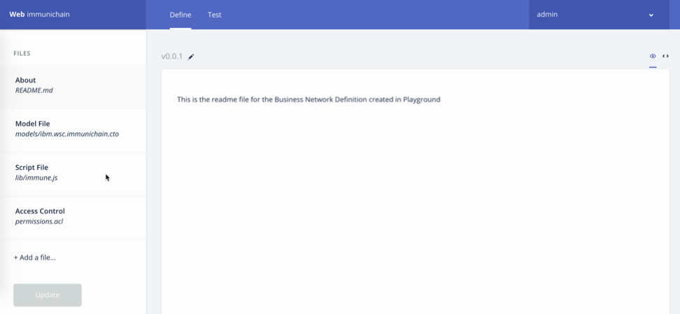

Part 2: Creating Assets and Participants
========================================

**1.** Now that you have an Immunichain Business Network, jump over to the Test section of the Composer Playground. The test area allows you to create assets, participants and submit transactions against your assets and participants. Your screen should look like this: 

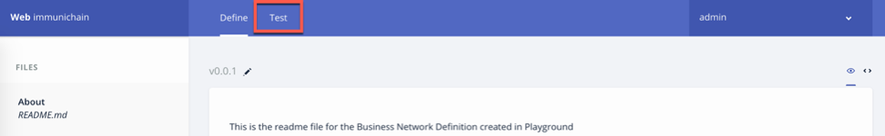

Before we create assets and participants, we need to know what each asset and participants represent. 
	- Guardian is the parent
	- MedProvider is simply a medical provider, like a doctor
	- Childform is simply the child or the asset in this business network

**2.** Now create a Guardian by clicking on +Create New Participant. Give the Guardian a number. I stick to 1, 2, 3 or low numbers that you can remember, but you can create any ID number you want. I suggest writing your ID numbers down as we move along. Once you have filled in the information click on Create

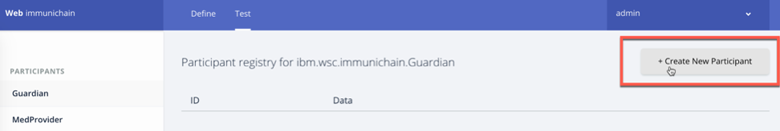

.. image:: Images/4.3.png

**3.** Once you have created a Guardian, your screen should look like this: 

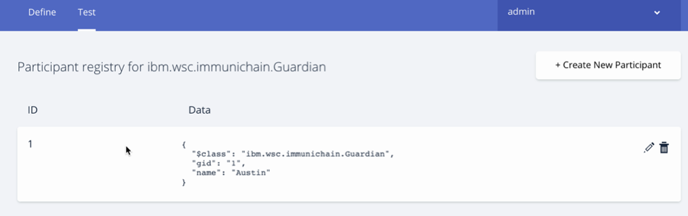

**4.** Go ahead and make a Medical Provider. Remember the Medical Provider number you create

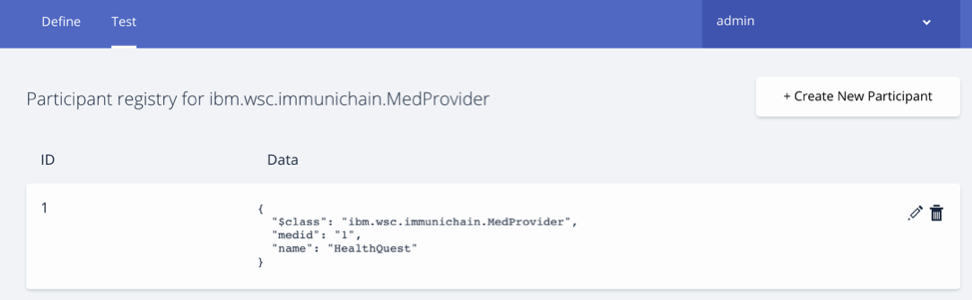

**5.** Now, let’s make a child. Click on optional properties at the bottom first. Assign him to the guardian you just created a step ago

.. image:: Images/4.6.png

**6.** Your screen should look like this when you are done:

.. image:: Images/4.7.png

**7.** Go ahead and create more medical providers, guardians and children. Just to remember to write down the ID numbers. This will make more sense when we submit transactions. 

Part 3: Submitting Transactions
===============================

**1.** Now, click on Submit Transaction in the bottom left and let’s authorize a member to view the health record of our child. You can change the type of transaction you want by click on the middle grey box. I have it in a square below

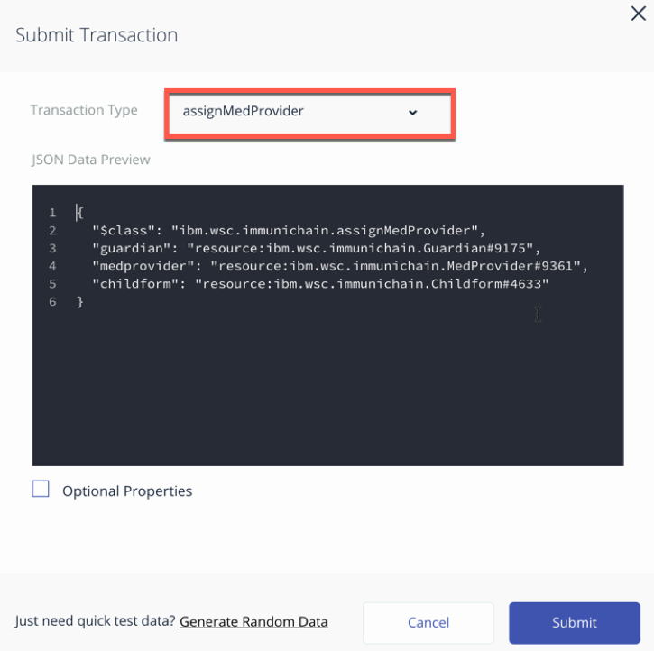

**2.** Now, let’s make an authorized medical provider transaction. Here is my transaction. You can make any type of transaction you want here

.. image:: Images/5.2.png

My transaction says let medical provider #1 (HealthQuest) have Child #1’s (Emily) healthcare record. This also means that HealthQuest can administer immunization shots to Emily.

**3.** You can view this transaction by clicking on childform on the left and then Show All on Emily. Notice that member 1 is now in Emily’s description

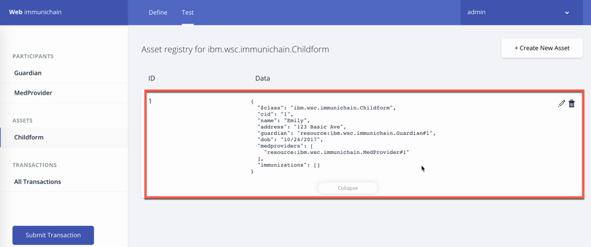

**4.** Click on Submit Transaction and then change the transaction type to addImmunizations. The format to add an immunization is a little different. In the Vaccine section put { "name" : "immunization", "provider" : "medical provider", "imdate" : "date" } inbetween the brackets. Replace the immunization, medical provider and date with whatever you would like. Here is what my transaction looks like::

{ "name" : "immunization", "provider" : "medical provider", "imdate" : "date" }

.. image:: Images/5.4.png

**5.** To view your immunization, go your child in the Childform section

.. image:: Images/5.5.png

**6.** Once you submit the transaction and it is good, click on All Transactions in the bottom left. This is what Composer likes to call the Historian. Now is a good time to tell you about the Historian. The Historian is the sequence of transactions or addition or removal of participants or assets. I didn’t tell you to look at the Historian when you were creating the Participants and Assets, but the Historian kept track of when and what type of participant or asset you created. You can scroll to the bottom to view the first transaction you created, which should be the Medical Provider - HealthQuest - or whatever you called it. You can see by clicking on view record. 

.. image:: Images/5.6.png

.. image:: Images/5.7.png

**7.** Continue to make various transactions that you want

Part 4: Adding a Participant Type and Transactions
==================================================

So far, everything has been a bit easy. Now, we are going to add a participant type and some transaction code for that new participant. It is important to follow the instructions as to where to add the code.

**1.** Head into your model file by going to the Define section and clicking on the Model File

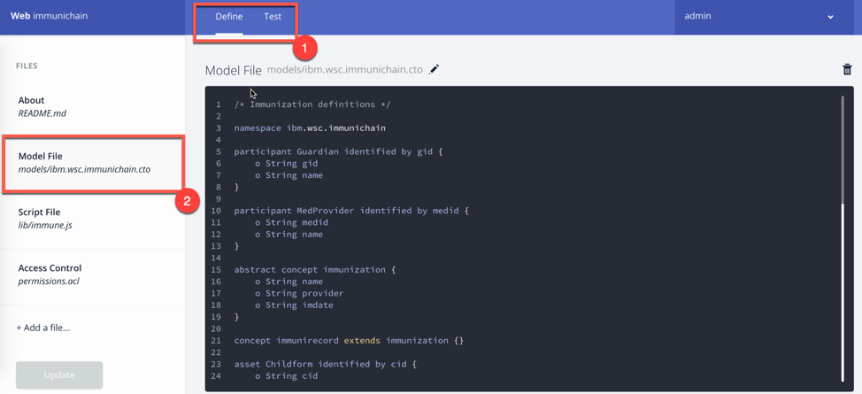

**2.** On line 15, add in this participant::

  participant Member identified by memid {
	o String memid
	o String name
  }

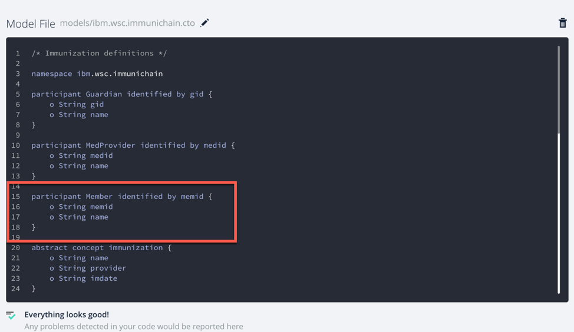

**3.** On line 35, add in this line in the asset childform::

  --> Member [] members optional

.. image:: Images/8.3.png

**4.** On line 47, add in this line in the transaction authMember::

	--> Member member

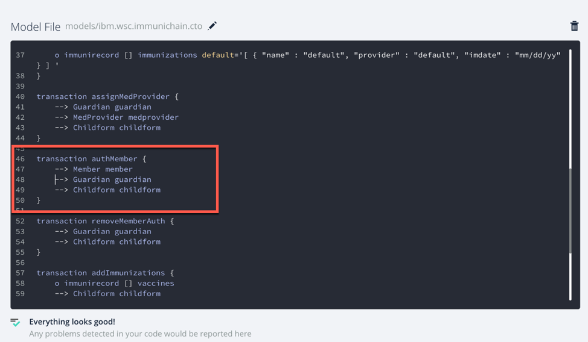

**5.** On line 53, add in this line in the transaction removeMemberAuth::

  --> Member member

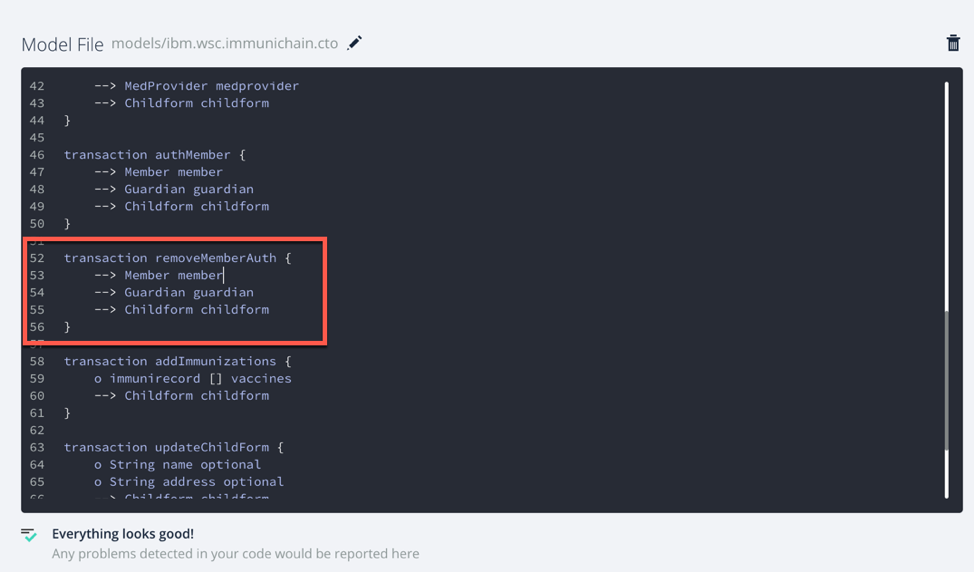

**Note** What other participants or assets could you see being added the Immunichain Blockchain network? Collaborate with a few people around you to gather ideas. Later you can add these participants and assets to your network. 

Now, let’s add some transactions.

**6.** Switch to the Script File (.js) in the Define Section

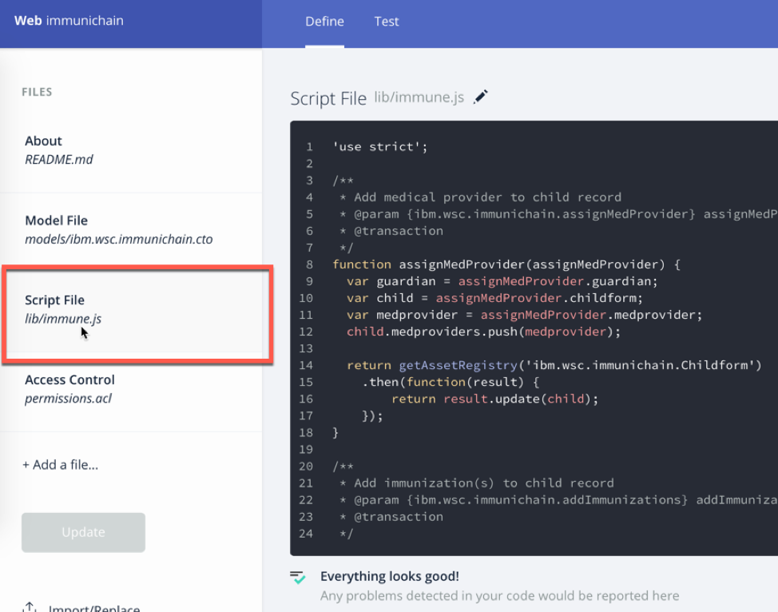

**7.** Around line 20, add in this transaction::

  /**
 	* Authorize member to child record
  * @param {ibm.wsc.immunichain.authMember} authMember - the authMember transaction
 	* @transaction
 	*/
  function authMember(authMember) {
  	var guardian = authMember.guardian;
  	var child = authMember.childform;
  	var member = authMember.member;
  	child.members.push(member);
  	return getAssetRegistry('ibm.wsc.immunichain.Childform')
    	.then(function(ChildRegistry) {
    	return ChildRegistry.update(child);
  	});
  }

.. image:: Images/8.7.png

**8.** Around line 36, add in this transaction as well::

  /**
 	* Deauthorize member to child record, so remove from members list
  * @param {ibm.wsc.immunichain.removeMemberAuth} removeMemberAuth - the removeMemberAuth transaction
 	* @transaction
 	*/
  function removeMemberAuth(removeMemberAuth) {
	var guardian = removeMemberAuth.guardian;
	var child = removeMemberAuth.childform;
	var member = removeMemberAuth.member;
	var mem = child.members;
	var idx = mem.indexOf(member);

	//if the member is in the array of Members, we can remove it
	if (idx !== -1){
	mem.splice(idx,1);
	}

	return getAssetRegistry('ibm.wsc.immunichain.Childform')
	.then(function(result) {
	return result.update(child);
            });
  }

Look at the picture below to get a sense of what to do.

.. image:: Images/8.8.png

**9.** Click on Deploy Changes to update your business network. Due to 0.19.0 in Hyperledger Composer, you will get a pop up asking for an installation card and upgrade card. Choose the PeerAdmin@hlfv1 card and click upgrade. You will see this pop up every time you upgrade your chaincode version.

Part 5: Submitting Transactions
===============================

**1.** Now that we have a new participant type, let’s create one. Jump to the test section and click on Member on the left. 

.. image:: Images/9.1.png

**2.** Click on Create New Participant and follow the steps below to add a Member.

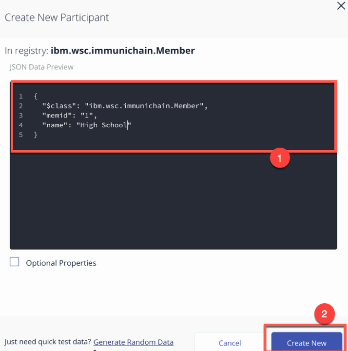

**3.** Now that we have created a Member, let’s make some transactions. Click on Submit Transaction in the bottom left.

**4.** A pop-up will appear with the transaction of adding Immunizations in the grey box. Switch to assignMedProvider to assign a Medical Provider to one of the children you’ve created

**5.** Now, replace the ID Numbers to replicate the guardian, medical provider and child. Look at the below picture to get a sense of what to do

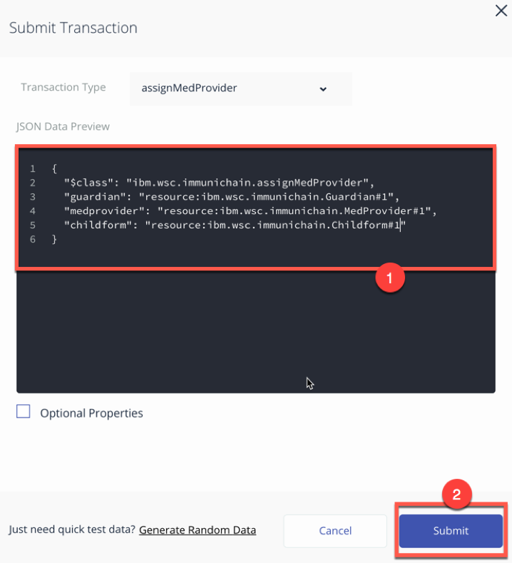

That basically says, assign medical provider #1 (Healthquest) to Child #1 (Emily).

**6.** Click Submit once you have the ID Numbers you want

**7.** Once you submit the transaction and it is good, click on All Transactions in the bottom left. This is what Composer likes to call the Historian. Now is a good time to tell you about the Historian. The Historian is the sequence of transactions or addition or removal of participants or assets. I didn’t tell you to look at the Historian when you were creating the Participants and assets, but the Historian kept track of when and what type of participant or asset you created. You can scroll to the bottom to view the first transaction you created, which should be the Medical Provider, HealthQuest or whatever you called it. You can see by clicking on view record. 

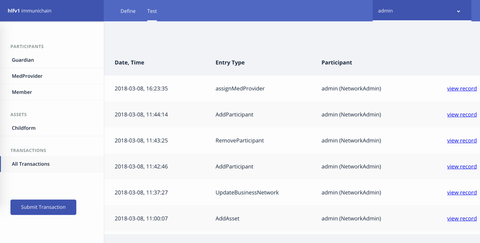

**8.** Back to our transaction, click on the Childform on the left. Find the child you assigned a Medical Provider to. Click on Show All to view the entire asset of your child. Notice the medical provider you assigned it to? 

.. image:: Images/9.5.png

**9.** Should we do another transaction? Of course! This time we will add a member to our child. To do this, we need to go back to our Child. 

**10.** Then click on the pencil in the top right of our child’s box.

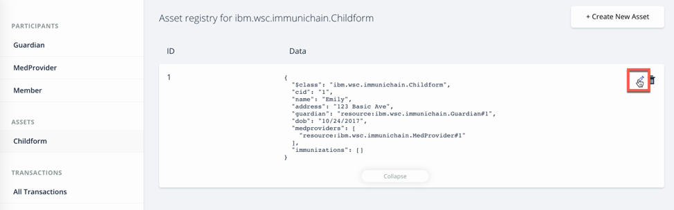

**11.** Click on Optional Properties. You will notice the member section appearing now. Then click on Update.

.. image:: Images/9.7.png

**12.** Now, click on Submit Transaction and let’s authorize a member to view the health record of our child. You can change the type of transaction you want by clicking on the middle grey box. 

**13.** Now, let’s make an authorized member transaction. Here is my transaction. You can make any type of transaction you want here

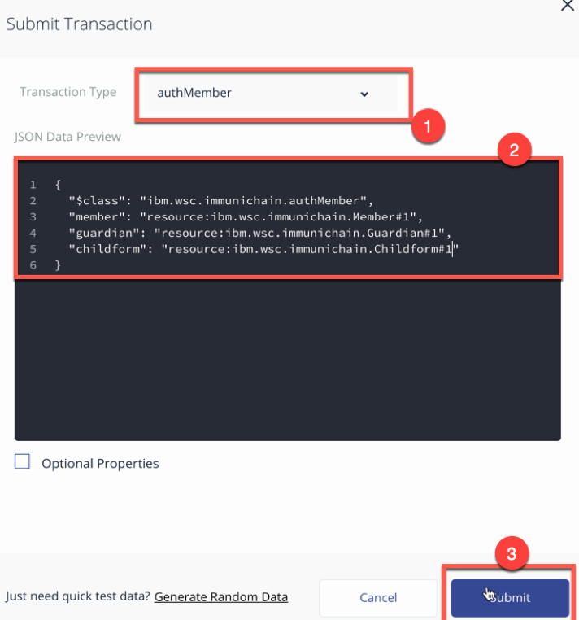

My transaction says let member #1 (High School) have Child #1’s (Emily) health record. This would be extremely useful when every year millions of kids get physicals in order to play a sport. Imagine having your medical provider authorize your child’s health record to approve them playing a sport. I know my mom would’ve enjoyed not going up to the High School an additional time. 

**14.** You can view this transaction by clicking on childform on the left and then Show All on Emily. Notice that member 1 is now in Emily’s description

.. image:: Images/9.9.png

**15.** We have submitted some transactions, but now let’s actually add some immunizations to a child

**16.** Click on Submit Transaction and then change the transaction type to addImmunizations. The format to add an immunization is a little different. In the Vaccine section put { "name" : "immunization", "provider" : "medical provider", "imdate" : "date" } in-between the brackets. Replace the immunization, medical provider and date with whatever you would like. Here is what my transaction looks like::

  { "name" : "immunization", "provider" : "medical provider", "imdate" : "date" }

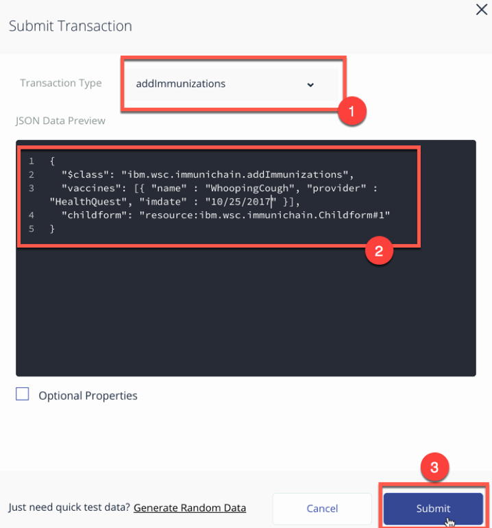

**17.** To view your immunization, go your child in the Childform section

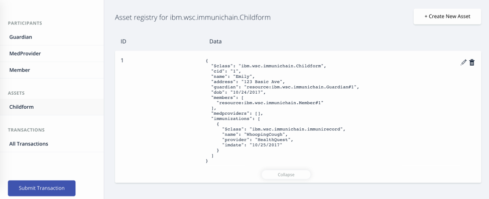

**18.** Continue to make various transactions that you want

What did you just accomplish?

You submitted transactions against participants and the assets within Composer. You understand the value of authorizing members, such as various high school athletics or even summer camps. Most importantly, you added Immunizations to your child, which is the whole point of Immunichain. 

Part 6: Modifying Permissions and Creating Identities
=====================================================

If you were to go to the permissions.acl file in the Define section, you would notice that there aren’t many rules in our network. In fact, the rules there mean anyone in the network can create, update, delete and submit transactions in the network. This doesn’t actually replicate what would happen in a real Immunichain business network. In this section we are going to change the permissions to the business network. You will notice these permissions by submitting transactions with the various participant identities you are about to create. 

**1.** Go to the Define section of Composer Playground. Then click on admin in the top right. Then click on ID Registry

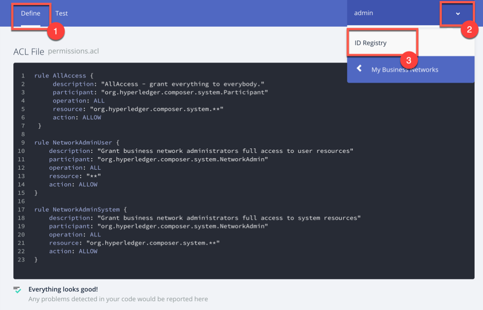

**2.** We are doing great if this is what your page looks like

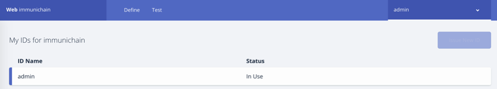

**3.** Click on Issue New ID

**4.** A pop-up will appear. Give your identity a name (disclaimer: the identity will be tied to a participant you created earlier in the lab; ie: Guardian Austin, Medical Provider HealthQuest). Then type in the number 1. You should now see the various participants that have an ID number of 1. If you gave your participants a different ID number, you won’t see anything by typing in 1. Instead, type in the number you gave to your participants. Here is what I did below:

.. image:: Images/10.3.png

**5.** If your screen looks like this, then we are in good shape

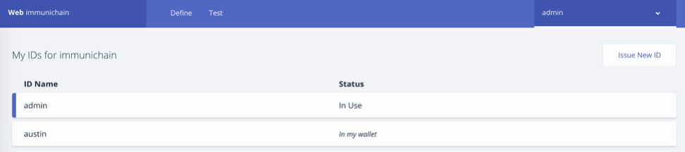

**6.** Go ahead and create other identities for your participants

**7.** I have a total of 4 identities in my business network. Here is what my screen looks like. You could have more identities if you created more, depending on how many participants your created in Part 2

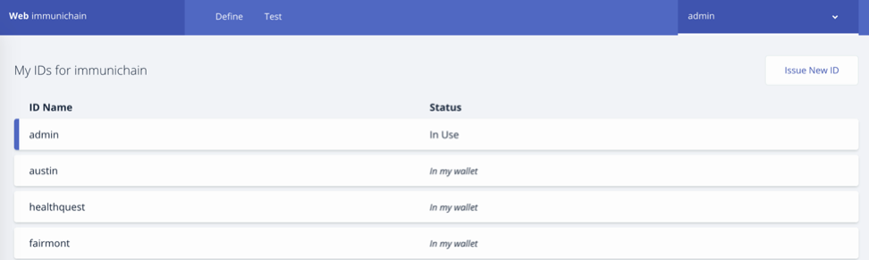

**8.** Since we are in the admin identity (make sure you see admin in the top right), lets change our permissions file. Click on Define and then Access Control in the bottom left.

.. image:: Images/10.6.png

**9.** In the permissions.acl file, copy all that is below::

  rule UpdatePersonal {
    	description: "Allow the guardian update the child's personal info"
   	  participant(g): "ibm.wsc.immunichain.Guardian"
    	operation: ALL
    	resource(c): "ibm.wsc.immunichain.Childform"
    	transaction(tx): "ibm.wsc.immunichain.updateChildForm"
    	condition: (c.guardian.getIdentifier() == g.getIdentifier())
    	action: ALLOW
  }

  rule txUpdatePersonal {
    	description: "Allow the guardian to update the child assets"
    	participant: "ibm.wsc.immunichain.Guardian"
    	operation: ALL
    	resource: "ibm.wsc.immunichain.updateChildForm"
    	action: ALLOW
  }

  rule AssignProvider {
    	description: "Allow the guardian to assign and update medical providers"
    	participant(g): "ibm.wsc.immunichain.Guardian"
    	operation: UPDATE
    	resource(c): "ibm.wsc.immunichain.Childform"
    	transaction(tx): "ibm.wsc.immunichain.assignMedProvider"
    	condition: (c.guardian.getIdentifier() == g.getIdentifier())
    	action: ALLOW
  }

  rule txAssignProvider {
    	description: "Allow the guardian to assign and update medical providers"
    	participant: "ibm.wsc.immunichain.Guardian"
    	operation: ALL
    	resource: "ibm.wsc.immunichain.assignMedProvider"
    	action: ALLOW
  }

  rule AuthMembers {
    	description: "Allow the guardian to authorize member organizations"
    	participant(g): "ibm.wsc.immunichain.Guardian"
    	operation: UPDATE
    	resource(c): "ibm.wsc.immunichain.Childform"
    	transaction(tx): "ibm.wsc.immunichain.authMember"
    	condition: (c.guardian.getIdentifier() == g.getIdentifier())
    	action: ALLOW
  }

  rule txUAuthMembers {
    	description: "Allow the guardian to authorize member organizations"
    	participant: "ibm.wsc.immunichain.Guardian"
    	operation: ALL
    	resource: "ibm.wsc.immunichain.authMember"
    	action: ALLOW
  }

  rule DeauthMembers {
    	description: "Allow the guardian to deauthorize member organizations"
    	participant(g): "ibm.wsc.immunichain.Guardian"
    	operation: UPDATE
    	resource(c): "ibm.wsc.immunichain.Childform"
    	transaction(tx): "ibm.wsc.immunichain.removeMemberAuth"
    	condition: (c.guardian.getIdentifier() == g.getIdentifier())
    	action: ALLOW
  }

  rule txDeauthMembers {
    	description: "Allow the guardian to deauthorize member organizations"
    	participant: "ibm.wsc.immunichain.Guardian"
    	operation: ALL
    	resource: "ibm.wsc.immunichain.removeMemberAuth"
    	action: ALLOW
  }

  rule Reassign {
    	description: "Allow the guardian to reassign their children (if of age)"
   	participant(g): "ibm.wsc.immunichain.Guardian"
    	operation: UPDATE
    	resource(c): "ibm.wsc.immunichain.Childform"
    	transaction(tx): "ibm.wsc.immunichain.reassignGuardian"
    	condition: (c.guardian.getIdentifier() == g.getIdentifier())
    	action: ALLOW
  }

  rule txReassign {
    	description: "Allow the guardian to reassign their children (if of age)"
    	participant: "ibm.wsc.immunichain.Guardian"
    	operation: ALL
    	resource: "ibm.wsc.immunichain.reassignGuardian"
    	action: ALLOW
  }

  rule GuardianRead {
    	description: "Allow guardians to view their own child's health record"
    	participant(g): "ibm.wsc.immunichain.Guardian"
    	operation: UPDATE, READ
    	resource(c): "ibm.wsc.immunichain.Childform"
    	condition: (c.guardian.getIdentifier() == g.getIdentifier())
    	action: ALLOW
  }

  rule readMembers {
    	description: "Allow guardians to view their own child's health record"
    	participant: "ibm.wsc.immunichain.Guardian"
    	operation: READ
    	resource: "ibm.wsc.immunichain.Member"
    	action: ALLOW
  }

  rule readMedicalProviders {
      description: "Allow the guardian to create medical providers in the network"
    	participant: "ibm.wsc.immunichain.Guardian"
    	operation: READ
    	resource: "ibm.wsc.immunichain.MedProvider"
    	action: ALLOW
  }

  rule addChild {
    	description: "Allow the Medical Provider to add a child in the network"
    	participant: "ibm.wsc.immunichain.MedProvider"
    	operation: CREATE
    	resource: "ibm.wsc.immunichain.Childform"
    	action: ALLOW
  }

  rule CreateChild {
    	description: "Allow the Guardian to add a child in the network"
    	participant: "ibm.wsc.immunichain.Guardian"
    	operation: CREATE
    	resource: "ibm.wsc.immunichain.Childform"
    	action: ALLOW
  }

  rule MedicalProviderRead {
      description: "Allow members to view children that have them as a member"
    	participant(g): "ibm.wsc.immunichain.MedProvider"
    	operation: UPDATE, READ
    	resource(c): "ibm.wsc.immunichain.Childform"
    	condition: (c.medproviders.some(function(MedProvider) {
    	return MedProvider.getIdentifier() == g.getIdentifier();
    	}))
    	action: ALLOW
  }

  rule medRead1 {
      description: "Allow the Medical Providers to read all the members available in the network"
    	participant: "ibm.wsc.immunichain.MedProvider"
    	operation: READ
    	resource: "ibm.wsc.immunichain.Member"
    	action: ALLOW 
  }

  rule medRead2 {
      description: "Allow the Medical provider to view all the guardian's in the network"
    	participant: "ibm.wsc.immunichain.MedProvider"
    	operation: READ
    	resource: "ibm.wsc.immunichain.Guardian"
    	action: ALLOW 
  }

  rule MemRead {
    	description: "Allow the Members to view all the Children in the network"
    	participant: "ibm.wsc.immunichain.Member"
    	operation: READ
    	resource: "ibm.wsc.immunichain.Childform"
    	action: ALLOW  
  }

  rule medUser {
      description: "Allow the Medical provider to view all the guardian's in the network"
    	participant: "ibm.wsc.immunichain.MedProvider"
    	operation: READ
    	resource: "org.hyperledger.composer.system.*"
    	action: ALLOW 
  }

  rule memberUser {
      description: "Allow the Medical provider to view all the guardian's in the network"
    	participant: "ibm.wsc.immunichain.Member"
    	operation: READ
    	resource: "org.hyperledger.composer.system.*"
    	action: ALLOW 
  }

  rule GuardanUser {
      description: "Allow the Medical provider to view all the guardian's in the network"
    	participant: "ibm.wsc.immunichain.Guardian"
    	operation: READ
    	resource: "org.hyperledger.composer.system.*"
    	action: ALLOW 
  }

**10.** Now, paste all that you have copied above the two rules you currently have. Here is what I my screen looks like now:

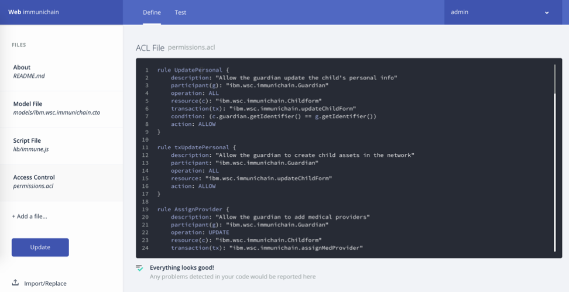

**11.** Once you are good to go, click on Deploy Changes in the bottom left and that will make changes across the entire business network. Read through some of the rules that we just implemented. What do you think will change as we go through the various identities?

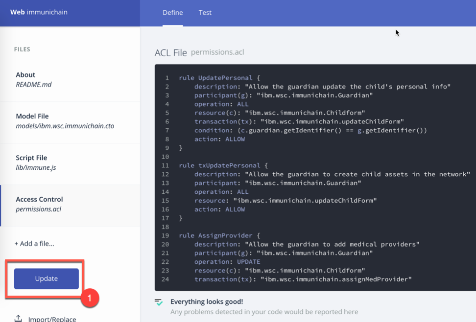

**12.** Click on admin in the top right again. This time, click on My Business Networks. This will take us to the Composer Playground homepage

**13.** Now your screen should look like this:

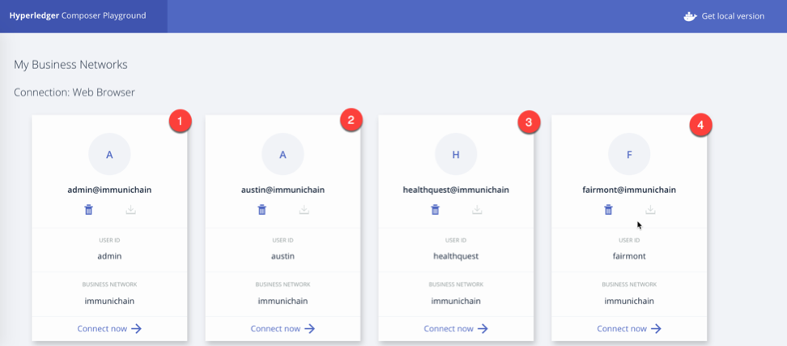

When you created the identities, Composer was creating ID Cards for those identities. That is why I have 4 ID Cards. They are all tied to the Immunichain business network and to the participants you created earlier. You could think of this as a 4 peer Blockchain network, with 1 of the peers being an admin who oversees the entire network. 

**14.** Go ahead and click on Connect Now with your Guardian ID.

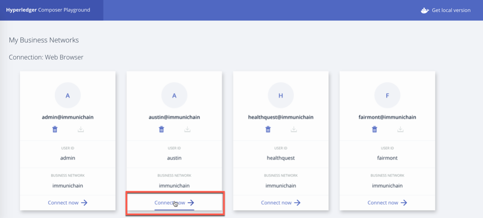

**15.** You are now in the Guardian’s perspective in the Immunichain business network. Go ahead and click on the other participants in the Test section

Medical Providers:

.. image:: Images/10.12.png

Members: 

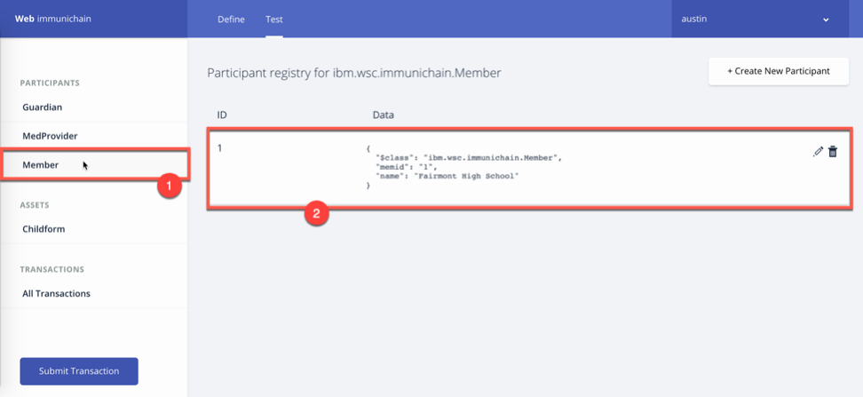

Child: 

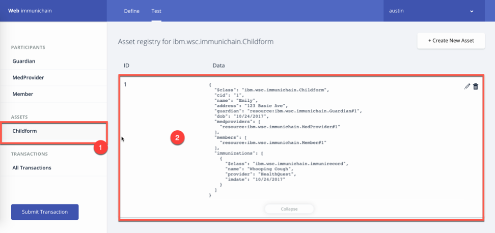

What did you notice about the permissions here? From the Guardian perspective, you can view all the Medical Providers, Members and Children that the Guardian has ownership of. 

**16.** Go ahead and update your Child by clicking on the pencil in the top right. Delete the Medical Providers and Members

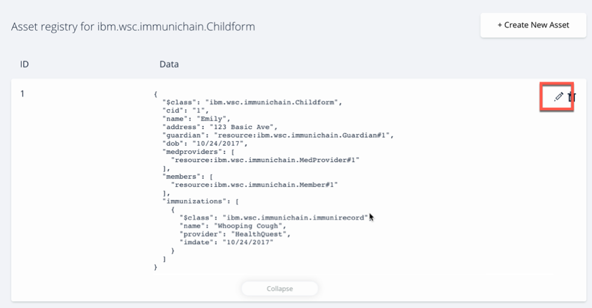

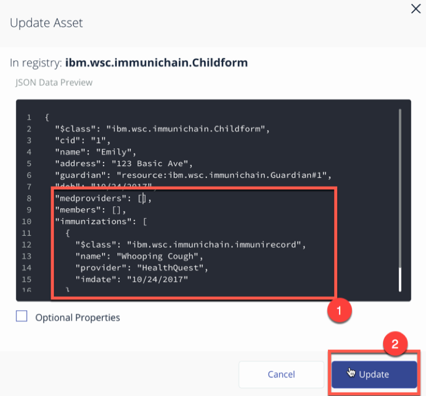

**17.** Submit transaction from the Guardian perspective. Start with assigning a Medical Provider. 

**18.** Submit another transaction by assigning a Member

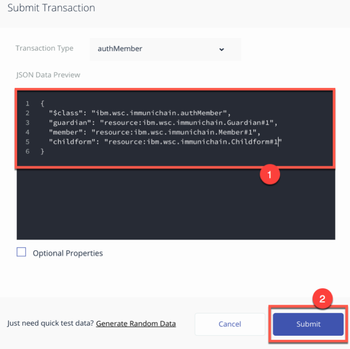

From the Guardian perspective, you are able to do a lot of different things. First, you can view the Children in the network that the Guardian has ownership of. Also, the guardian can create additional children with the way the permissions are set up. Do you think this is a viable option in a production environment? I would say no, but rather you should have the Medical Provider, who administered the birth of the Child, create the Child asset. In a production environment, this would be negotiated between all the participants in the business network. Also, as the Guardian you can also view all the Members and Medical Providers. Why do you think that is so? When you have a child as a guardian you want to be able to view all the options you have as possible Medical Providers and Members. In a real-world scenario, maybe the Guardian would only view all the Medical Providers that are tied to their Health Insurance, but that would require an Insurer in this Immunichain business network. Maybe in the future :) 

**19.** I think you’re getting the sense from the Guardian perspective. Before we jump to another perspective, delete all Members. You previously did this from step 16 in this part. Once you have successfully done that, go ahead and switch to the Medical Provider perspective. Click on My Business Networks in the top right. Then click on Connect Now on the Medical Provider

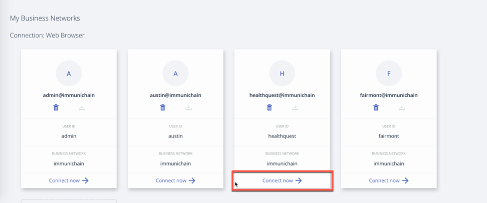

**20.** Click around on the other participants in the Immunichain Business Network

Guardian: 

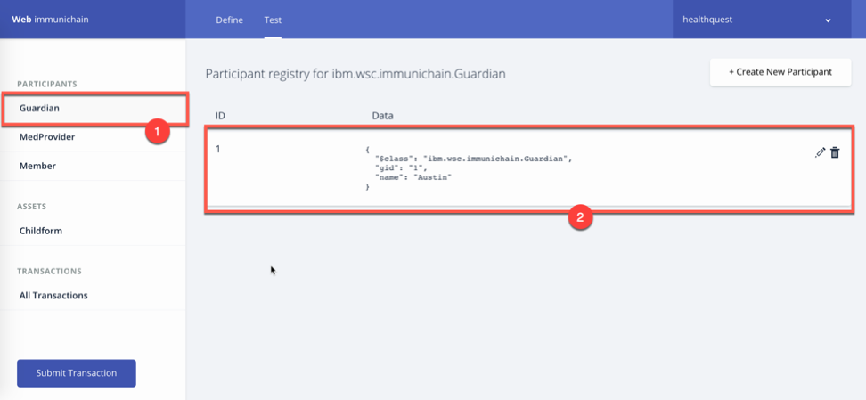

Members:

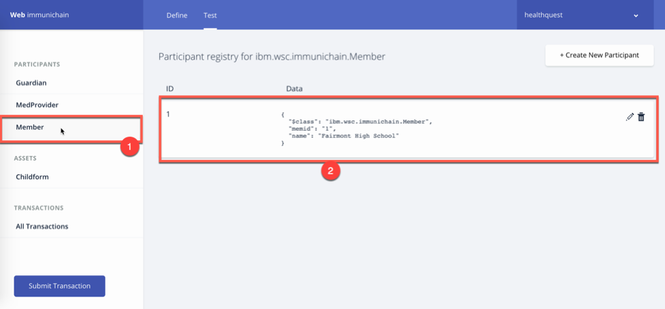

Child: 

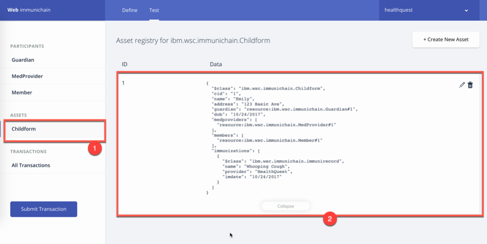

**21.** Click on Submit Transaction. Start with assigning a Member

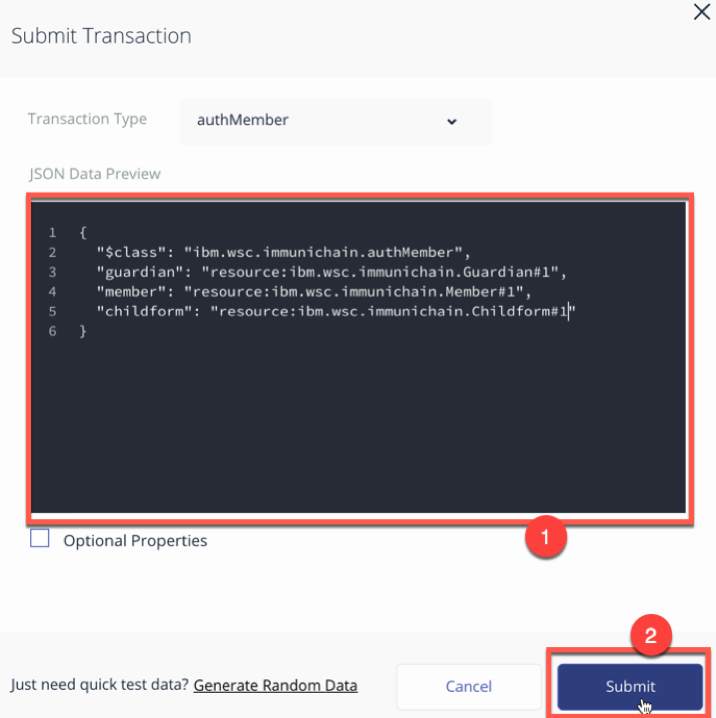

**22.** Now, create another Child asset. Have the Child’s guardian be the first Guardian. In my business network, this would be Guardian Austin. 

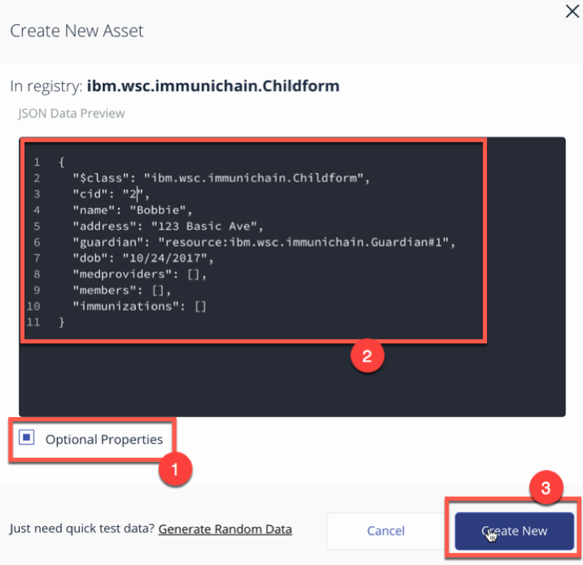

.. image:: Images/10.25.png

If you noticed, I now have TWINS! My life suddenly got crazy for a 23-year-old. I guess I need to continue work in order to support them. Or just become a crypto-currency millionaire (I don’t know if that’s possible these days). 

On a slightly more serious note, maybe having the Medical Provider create additional children isn’t the best idea. It really depends on who the Medical Provider is. Is it the hospital? Or more specifically, is the Medical Provider the doctor who works in the baby delivery department of the hospital? Should the Medical Provider be able to create the child, or should we leave it up to the Guardians to create the children? These types of conversations have to occur between the peers in the business network if this was to be a production environment. 

**23.** Great, we just created another Child. Jump back over to the Guardian perspective. Did the new Child show up? 

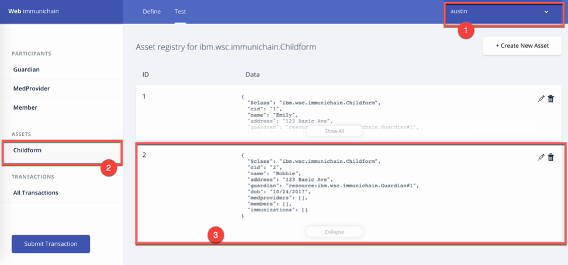

**24.** Go ahead and only assign a Medical Provider to the new Child by submitting a transaction 

**25.** Should we jump to the Member perspective? Absolutely! 

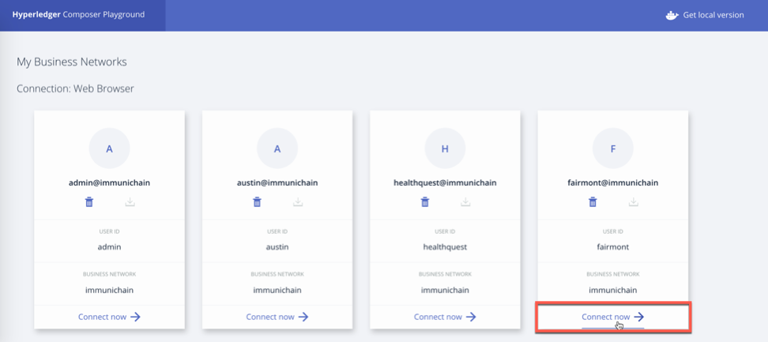

**26.** Look around at the various participants in the Immunichain business network

Child: 

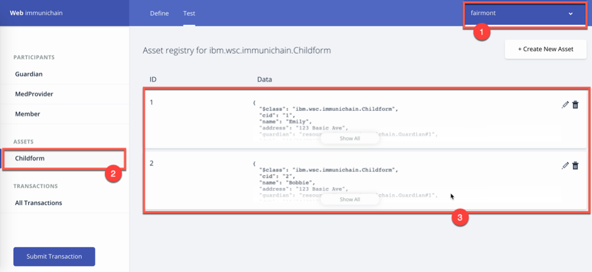

**27.** If you noticed, all the children showed up. Click on Show All on the Bobbie, you notice that this member isn’t listed as one her authorized Members.

.. image:: Images/10.29.png

Is this a good thing – that Bobbie appeared to this member? Absolutely not. This would be a non-negotiable in the business network. You wouldn’t want a Member to be able to see a Child, unless it has authorization. Could you imagine a Member being able to read all the Immunization records of every Child? We have to modify the permissions in our Access Control file. 

See if you can modify the rule in the Access Control file in the Define section.
