Part 1: Setting Up Your LinuxONE Community Cloud (LinuxONE CC) Account
======================================================================

**1.**  From your browser, go to https://developer.ibm.com/linuxone/

**2.** Click on Start your trial now

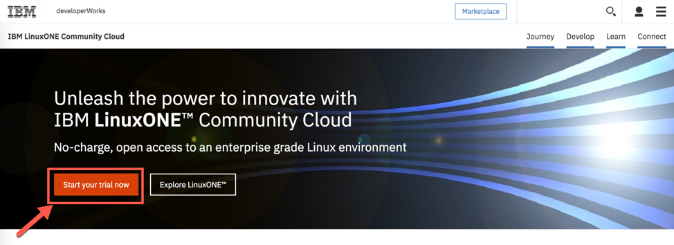

**3.** Complete the required fields, once filled in click on Request your trial

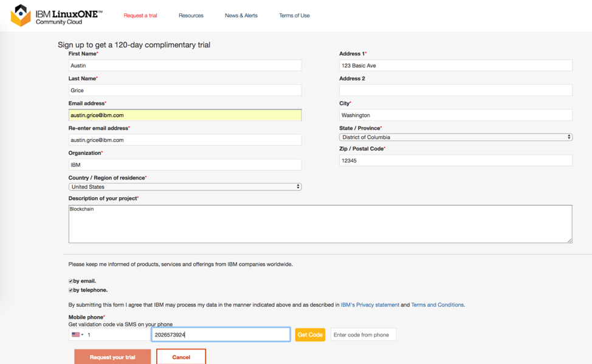

**4.** You will receive an email containing your User ID and Password. Follow the link to the LinuxONE CC

**5.** You’ll be at the website asking for your User ID and Password. Enter your credentials and click on Sign in

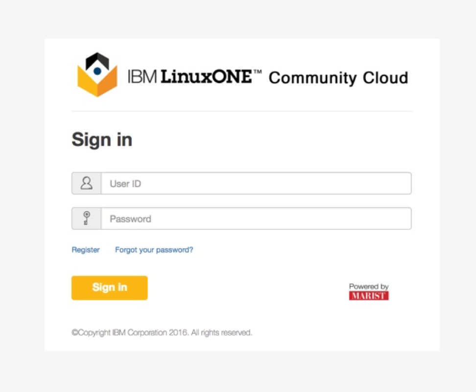

**6.** You’ll now be on the LinuxONE CC Home Page. Click on the Manage Instances under the Infrastructure section

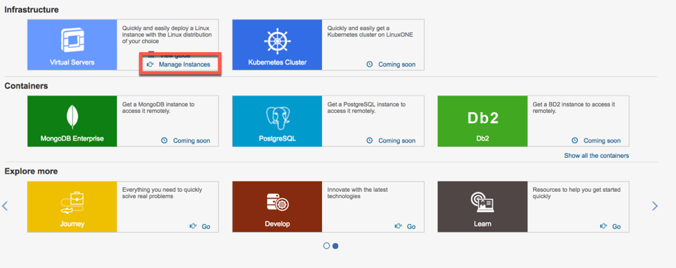

**7.** Click on Create

**8.** Select the correct information::
	
  Type: General Purpose VM
	Instance Name: Immunichain
	Instance Description: (whatever you like)
 	Image: SLES12 SP3
	Flavor: LinuxONE-Medium

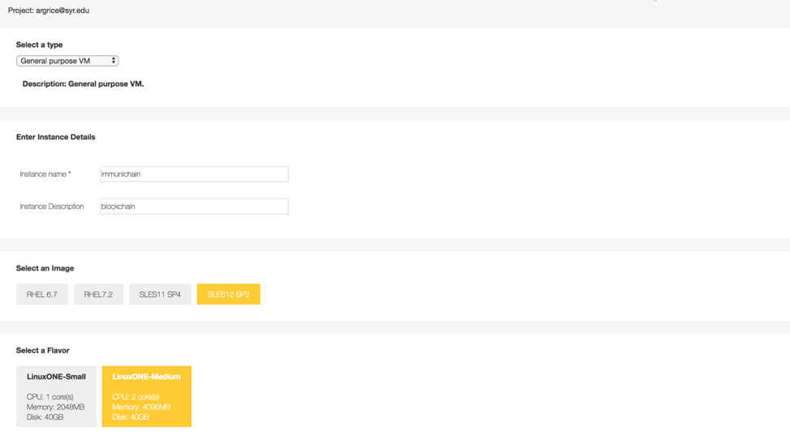

**9.** Under the SSH Key Pair section, click on Create

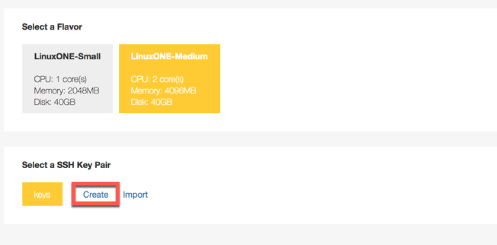

**10.** In the pop-up box, enter a name you would like to give your keys. Then click on Create a new key pair

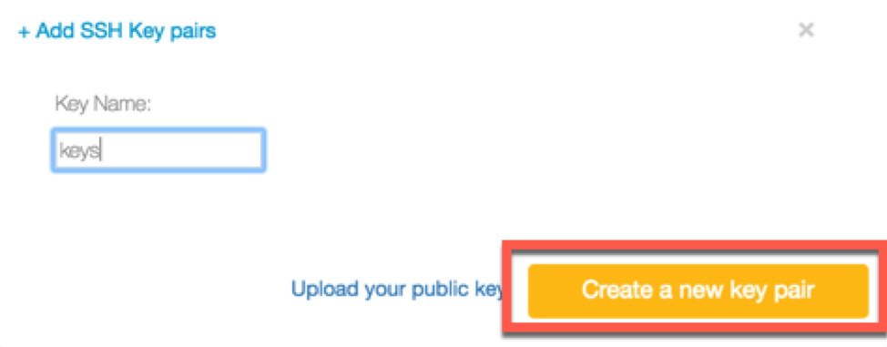

**11.** You will then be prompted to save the file (keys). Click on Save File. If you didn’t get prompted, it might of automatically download to your folders

**12. ** Back on the LinuxONE CC, select your new keys in the SSH Key Pair section

**13.** Review all the selections you selected and click on Create

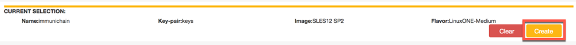

**14. ** You will see the Instance starting up. Once it says ACTIVE in the status column you are good to go. Note your IP Address. It might be best to write down your IP Address. You can always toggle between your terminal and the LinuxONE CC website. 

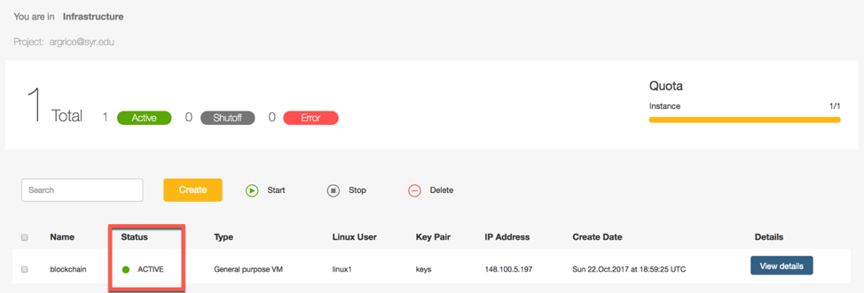

 **15.** You can just ssh linux1@xxx.xxx.x.xx to connect to your Linux guest. If that doesn’t work jump to the next step. If that does work, jump to step 19

**16.** From your terminal, navigate to where you downloaded your keys

**17.** Modify the permissions of your private key by entering chmod 600 keyname.pem::
	
	keyname refers to what you named your keys

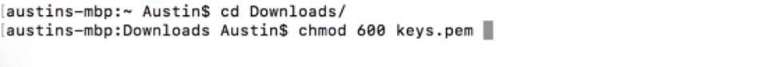

**18.** From the path where your keys are located enter ssh –i keyname.pem linux1@xxx.xxx.xxx.xxx:: 

	xxx.xxx.xxx.xxx refers to your LinuxONE Community Cloud IP Address

**19.** Type yes when you are prompted to continue connecting to your instance

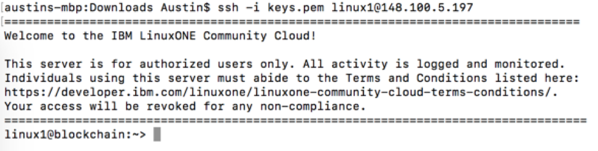

**20.** You are now connected to your LinuxONE CC instance! 

Why stop now, we are just now having fun! Continue to the next part. 

Part 2: Getting Your Linux Guest Ready for Composer Playground
==============================================================

The previous part got you ready for Hyperledger Playground from the perspective of creating your LinuxONE Community Cloud Instance. This part will now get you ready from the perspective of your active Linux guest. Don’t worry, this part is extremely short!

**1.** Run this command to create a new file. This file will be a script to download Composer locally onto our Linux instance::

  linux1@blockchain:~> touch Linux1BlockchainScript.sh

**2.** Copy and paste this script into our new file::

	#!/bin/bash

	# Sanity checks
	relog=false
	# Check for docker group
	if ! $( id -Gn | grep -wq docker ); then
  	sudo usermod -aG docker linux1
  echo "ID linux1 was not a member of the docker group. This has been corrected."
  	relog=true
	fi
	# Check PATH for /data/npm/bin
	if ! $( echo $PATH | grep -q /data/npm/bin ); then
  	echo "export PATH=/data/npm/bin:$PATH" >> $HOME/.profile
 	echo "PATH was missing '/data/npm/bin'. This has been corrected."
 	 relog=true
	fi
	# Relog needed?
	if [[ "$relog" = true ]]; then
  echo "Some changes have been made that require you to log out and log back in."
  	echo "Please do this now and then re-run this script."
  	exit 1
	fi
	# Ensure /data exists
	if [[ ! -d "/data" ]]; then
  echo "/data disk is missing. It could take up to 10 minutes to format and mount the /data disk. Issue 'df -h' to verify the /data disk is available before running this script again. When /data is available, please run this script again."
  	exit 2
	fi
	# END Sanity checks

	printf "

	IBM Master the Mainframe

	::::::::::::::::::::::::::::::::::::::::::::::::::::::::::::::::::
	:::::::::::''  ''::'      '::::::  ::::::::::::::'.:::::::::::::::
	:::::::::' :. :  :         :::: :  :::::::::::.:::':::::::::::::::
	::::::::::  :   :::.       ::: M :::::::..::::'     :::: : :::::::
	::::::::    :':  '::'     '' M   M :::::: :'           '' ':::::::
	:'        : '   :  ::    . M       M   '                        .:
	:               :  .:: . M           M                         :::
	:. .,.        :::  ':: M M M       M M M                 .:...::::
	:::::::.      '      M   M   M   M   M   M               :: :::::.
	::::::::           M     M     M     M     M   '    '   .:::::::::
	::::::::.        ::: M   M           M   M :         ''' :::::::::
	::::::::::      :::::: M M           M M             :::::::::::::
	: .::::::::.   .:''::::: M           M   ::   :   '::.::::::::::::
	:::::::::::::::. '  '::::: M       M   :::::.:.:.:.:.:::::::::::::
	:::::::::::::::: :     ':::: M   M  ' ,:::::::::: : :.:'::::::::::
	::::::::::::::::: '     :::::: M    . :'::::::::::::::' ':::::::::
	::::::::::::::::::''   :::::::: : :' : ,:::vem:::::'      ':::::::
	:::::::::::::::::'   .::::::::::::  ::::::::::::::::       :::::::
	:::::::::::::::::. .::::::::::::::::::::::::::::::::::::.'::::::::

	IBM Master the Mainframe

	"

	#Install NodeJS
	echo -e “*** install_nodejs ***”
	cd /tmp
	wget -q https://nodejs.org/dist/v8.9.4/node-v8.9.4-linux-s390x.tar.gz
  cd /usr/local && sudo tar --strip-components=1 -xzf /tmp/node-v8.9.4-linux-s390x.tar.gz
	echo -e “*** Done withe NodeJS ***\n”

	#Setup and install docker-compose
	echo -e “*** Installing docker-compose. ***\n”
	sudo zypper install -y python-pyOpenSSL python-setuptools
	sudo easy_install pip
	sudo pip install docker-compose==1.13.0
	echo -e “*** Done with docker-compose. ***\n”

	#Install Hyperledger Composer Components
  echo -e “*** Installing Hyperledger Composer command line tools. ***\n”
	mkdir /data/linux1/ 
	npm config set prefix '/data/npm'
	npm config set cache /data/linux1/.npm
	export PATH=/data/npm/bin:$PATH
	cd /data/linux1/
	npm install -g composer-cli@0.19.0

	echo -e “*** Installing Hyperledger Composer rest server. ***\n”
	npm install -g composer-rest-server@0.19.0

	echo -e “*** Installing Hyperledger Composer playground. ***\n”
	npm install -g composer-playground@0.19.0

	echo -e "*** Clone and install the Coposer Tools repository.***\n"
	mkdir ~/fabric-tools && cd ~/fabric-tools
	curl -O https://raw.githubusercontent.com/hyperledger/composer-	tools/master/packages/fabric-dev-servers/fabric-dev-servers.tar.gz
	tar -xvf fabric-dev-servers.tar.gz
	export FABRIC_VERSION=hlfv11
	echo "export FABRIC_VERSION=hlfv11" >> $HOME/.profile
	./downloadFabric.sh
	./startFabric.sh
	./createPeerAdminCard.sh
	mkdir /data/playground/
  nohup composer-playground >/data/playground/playground.stdout   2>/data/playground/playground.stderr & disown
	sudo iptables -I INPUT 1 -p tcp --dport 8080 -j ACCEPT
	sudo iptables -I INPUT 1 -p tcp --dport 3000 -j ACCEPT
	sudo iptables -I INPUT 1 -p tcp --dport 1880 -j ACCEPT
	sudo bash -c "iptables-save > /etc/linuxone/iptables.save"

	#Install NodeRed
	echo -e "*** Installing NodeRed. ***\n"
	npm install -g node-red
  nohup node-red >/data/playground/nodered.stdout 2>/data/playground/nodered.stderr & disown

	# Persist PATH setting
	# Check PATH for /data/npm/bin
	if ! $( echo $PATH | grep -q /data/npm/bin ); then
 	echo "export PATH=/data/npm/bin:$PATH" >> $HOME/.profile
  	echo "PATH was missing '/data/npm/bin'. This has been corrected."
	fi

	# Persist docker group addition
	sudo usermod -aG docker linux1

  echo "Please log out of this system and log back in to pick up the group and PATH changes."

**3.** Make the file executable by entering chmod u+x Linux1BlockchainScript.sh::

	linux1@blockchain:~> chmod u+x Linux1BlockchainScript.sh

**4.** Enter ls -l again to see the file again

**5.** Return back one directory cd .. and enter df –h if you do not see “/data” in the mounted column, wait a few moments before going onto the next step::

	linux1@blockchain:~> df -h
	Filesystem      Size  Used Avail Use% Mounted on
	devtmpfs        2.0G  8.0K  2.0G   1% /dev
	tmpfs           2.0G     0  2.0G   0% /dev/shm
	tmpfs           2.0G  219M  1.7G  12% /run
	tmpfs           2.0G     0  2.0G   0% /sys/fs/cgroup
	/dev/dasda2     5.8G  3.2G  2.4G  58% /
	/dev/dasda1     388M   47M  322M  13% /boot/zipl
	**/dev/dasdb1      45G  5.0G   37G  12% /data**
    tmpfs           391M     0  391M   0% /run/user/1001

**6.** Now, run the file by entering ./Linux1BlockchainScript.sh – Be patient, this script will take 7 to 10 minutes to run. If it doesn’t want to run, you might need to exit out of your Linux guest and sign back in::

	linux1@blockchain:~> ./Linux1BlockchainScript.sh

**7.** The first time you run the script you will need to exit in order for permissions and environment variables to take effect. You can do this by entering exit once you get your command line back

**8.** Now you can log back into your Linux guest

**9.** Now, verify that you have running Hyperledger Fabric Docker containers network by entering docker ps –a

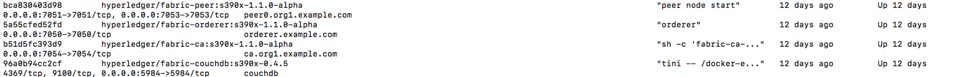

Congratulations if you just did all of this successfully. You just did the hard part. In next part we will start Immunichain. 

Part 3: Fabric Immunichain
==========================

**1.** Go to your IP address with the port of 8080 within a browser. Your IP address is from your LinuxONE Community Cloud instance. Google Chrome is preferred, but Firefox works just as well::

	148.100.xxx.xxx:8080

**2.** You will get a Welcome pop-up box with a graphic and a few words. Click on Let’s Blockchain

.. image:: Images/3.1.png

**3.** Then you will be in the Composer Playground homepage. Click on Deploy a New Business Network to the right of the PeerAdmin Card. Make sure it says hlfv1 in the top left.

**4.** Select empty-business-network. Then give your business network a name and a description. 

	Select: empty-business-network
	Business Network Name: immunichain
	Description: tracking of immunization records

**5.** Then scroll down and select ID and Secret. For Enrollment ID enter admin and for Enrollment Secret enter adminpw. Scroll back up and click on Deploy::

	Enrollment ID: admin
	Enrollment Secret: adminpw

**6.** Then click on Deploy 

Afterwards, you can come back to the Composer Playground play with some of the other sample business network applications, like animal tracking or vehicle lifecycles.

**7.** You will then be taken to Your Wallet. Your wallet is basically a quick, seamless connection to multiple connections that you can jump around with. You will see later how easy it is. Click on Connect now in order to get connected to our immunichain network

.. image:: Images/3.5.png

**8.** Fill in your model file with the below text::

  /* Immunization definitions */

  namespace ibm.wsc.immunichain

  participant Guardian identified by gid {
	o String gid
	o String name
  }

  participant MedProvider identified by medid {
	o String medid
	o String name
  }

  abstract concept immunization {
	o String name
	o String provider
	o String imdate
  }

  concept immunirecord extends immunization {}

  asset Childform identified by cid {
	o String cid
	o String name
	o String address
	--> Guardian guardian
	o String dob
	--> MedProvider [] medproviders optional
	o immunirecord [] immunizations
  }
 
  transaction assignMedProvider {
	--> Guardian guardian
	--> MedProvider medprovider
	--> Childform childform
  }

  transaction authMember {
	--> Guardian guardian
	--> Childform childform
  }

  transaction removeMemberAuth {
	--> Guardian guardian
	--> Childform childform
  }

  transaction addImmunizations {
	o immunirecord [] vaccines
	--> Childform childform
  }

  transaction updateChildForm {
	o String name optional
	o String address optional
	--> Childform childform
  }

  transaction reassignGuardian {
  	--> Guardian oldguardian
    	--> Guardian newguardian
	--> Childform childform
  }

**9.** Then click on Add a File in the bottom left. Then select Script File (.js) and click on Add. 

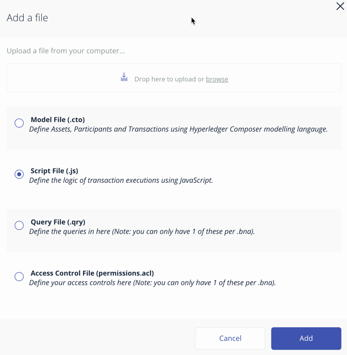

**10.** Replace the content of the Script file with the following below::

  'use strict';

  /**
 	* Add medical provider to child record
  * @param {ibm.wsc.immunichain.assignMedProvider} assignMedProvider - the assignMedProvider transaction
 	* @transaction
 	*/
  function assignMedProvider(assignMedProvider) {
  	var guardian = assignMedProvider.guardian;
  	var child = assignMedProvider.childform;
  	var medprovider = assignMedProvider.medprovider;
  	child.medproviders.push(medprovider);
  
  	return getAssetRegistry('ibm.wsc.immunichain.Childform')
   	.then(function(result) {
    	return result.update(child);
  	});
  }

  /**
 	* Add immunization(s) to child record
  * @param {ibm.wsc.immunichain.addImmunizations} addImmunizations - the addImmunizations transaction
 	* @transaction
 	*/
  function addImmunizations(addImmunizations){
	var vaccines = addImmunizations.vaccines;
	var child = addImmunizations.childform;
 	var immunizations = child.immunizations;
  /*  	if (immunizations[0].name == 'default'){
    	immunizations.splice(0,1) 
    	} */
  	immunizations.push.apply(immunizations,vaccines);
  
	return getAssetRegistry('ibm.wsc.immunichain.Childform')
		.then(function(ChildRegistry){
			//save the childform
			return ChildRegistry.update(child);
		});
  }

  /**
 	* Update information on child record, can only be done by guardian
  * @param {ibm.wsc.immunichain.updateChildForm} updateChildForm - the updateChildForm transaction
 	* @transaction
 	*/
  function updateChildForm(updateChildForm){
  	var newaddress = null;
  	var newname = null;
    	var child = updateChildForm.childform;
  	newaddress = updateChildForm.address;
  	newname = updateChildForm.name;
  
  	if (newaddress != null && newname != null){
    	child.name = newname;
      	child.address = newaddress;
    	}
  	else if (newaddress != null){
    	child.address = newaddress;
    	}
 	else if (newname != null){
    	child.name = newname;
    	}
	return getAssetRegistry('ibm.wsc.immunichain.Childform')
		.then(function(ChildRegistry){
			//save the childform
			return ChildRegistry.update(child);
		});
  }

  /**
 	* Assign child to his/herself when he/she is of legal age
  * @param {ibm.wsc.immunichain.reassignGuardian} reassignGuardian - the reassignGuardian transaction
  * @transaction
 	*/
  function reassignGuardian(reassignGuardian) {
  	var oldguardian = reassignGuardian.oldguardian;
  	var newguardian = reassignGuardian.newguardian;
  	var child = reassignGuardian.childform;
  	child.guardian = newguardian;
  
  	return getAssetRegistry('ibm.wsc.immunichain.Childform')
    	.then(function(result) {
    	return result.update(child);
  	});
  }

  /**
 	* Get the immunizations for a child
 	* @query
 	* @param {String} cid - the unique id assigned to the childform
 	* @returns {immunirecord[]} - the immunizations that the child has gotten
  */
  function listImmunizations(cid) {
  	return query('select x.immunizations from Childform where x.cid ==: cid');
  }

**11.** Then click on Deploy Changes in the bottom left. 

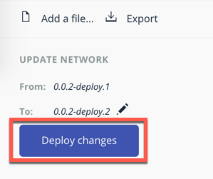

In 0.19.0, they changed Update to Deploy Changes. Even in the Bluemix version of Composer, you are deploying this network to Fabric. When you hit the Deploy Changes button, you have to give that chaincode a version, but it has to go in sequential order. For example, 0.0.1 would move to 0.0.2 – thus cannot go from 0.0.1 to 0.0.3. If you were not to rename your chaincode version, the deploy-0 to deploy-1 would also work due to the sequential requirement. 

**12.** After you have done that, your screen should look like this. If it does, then we are in business (get it? In business, business network – great!)

.. image:: Images/3.8.png

**13.** To verify that you actually are, go to your command line and enter docker ps –a and notice a docker container that starts out as dev-peer0::

	docker ps -a

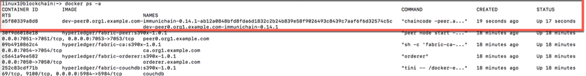

Part 4: Creating Assets and Participants
========================================

This section is very similar to Part 4. You are going to create assets and participants in our Immunichain network. This time connected to the Hyperledger Fabric. Whenever you connect Composer to a running Fabric, you deploy your running business network (BNA file) as a chaincode as a Docker container. The different participants and assets you create in this network are going to be stored in the chaincode. This means whenever you update the network, the chaincode will be updated. Let’s say you want to add another participant type to our network, the chaincode will update to represent the additional participant. 

**1.** Now that you have an Immunichain Business Network connected to the Hyperledger Fabric, jump over to the Test section of the Composer Playground. The test area allows you to create assets, participants and submit transactions against your assets and participants. Your screen should look like this: 

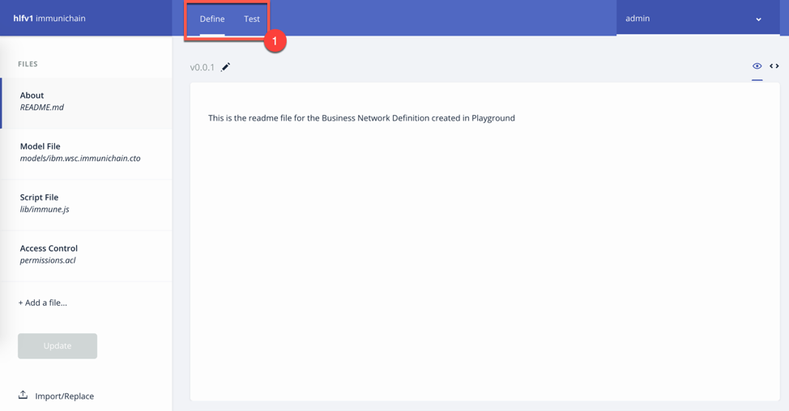

Before we create assets and participants, we need to know what each asset and participants represent. 
	- Guardian is the parent
	- MedProvider is simply a medical provider, like a doctor
	- Childform is simply the child or the asset in this business network

**2.** Now create a Guardian by clicking on +Create New Participant. Give the Guardian a number. I stick to 1, 2, 3 or low numbers that you can remember, but you can create any ID number you want. I suggest writing your ID numbers down as we move along. Once you have filled in the information click on Create

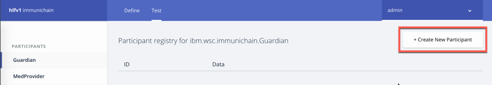

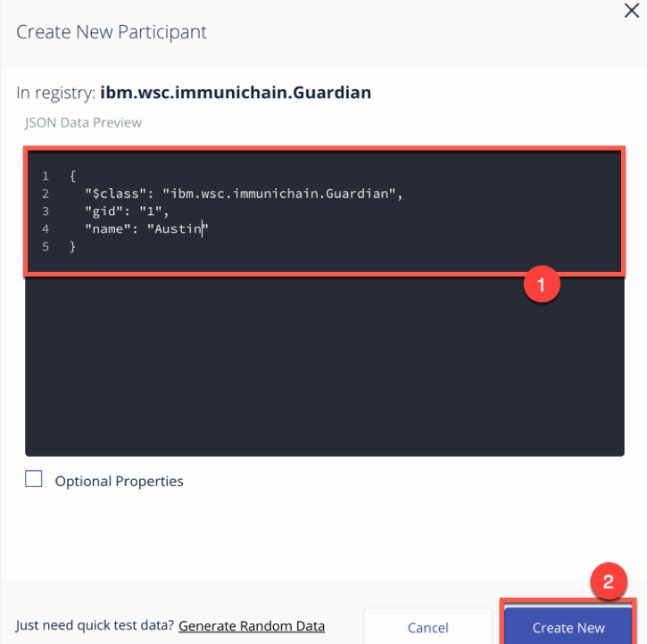

**3.** Once you have created a Guardian, your screen should look like this: 

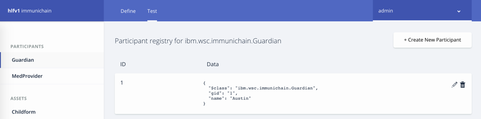

**4.** Go ahead and make a Medical Provider. Remember the Medical Provider number you create

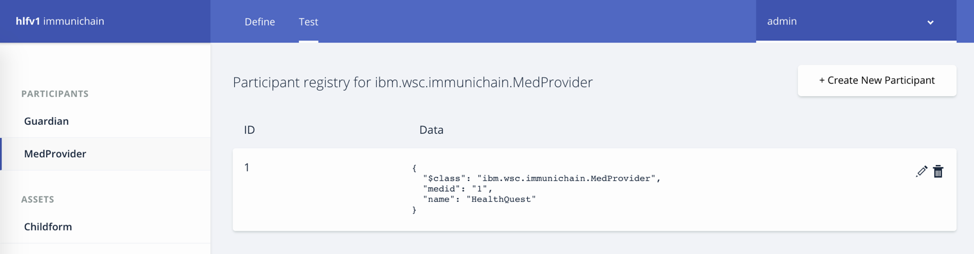

**5.** Now, let’s make a child. Click on optional properties at the bottom first. Assign him to the guardian you just created a step ago

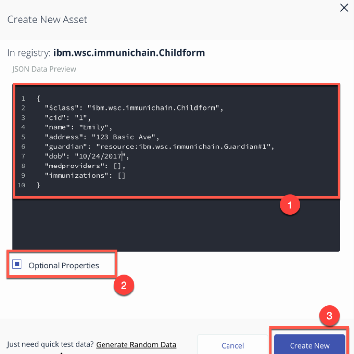

**6.** Your screen should look like this when you are done:

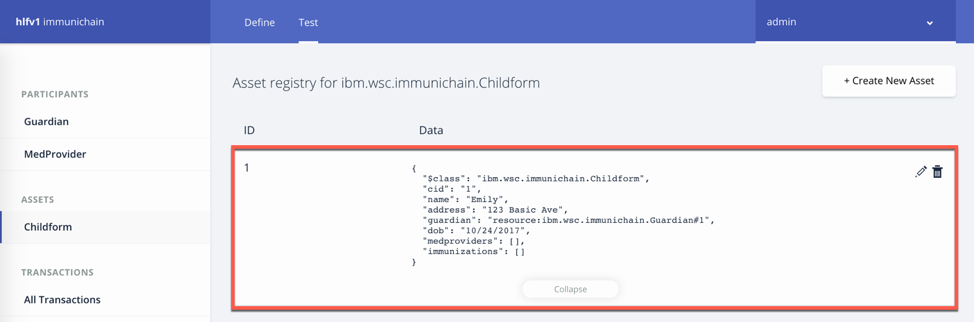

**7.** Go ahead and create more medical providers, members, guardians and children. Just to remember to write down the ID numbers. This will make more sense when we submit transactions. 

Part 5: Adding a Participant Type and Transactions
==================================================

So far, everything has been a bit easy. Now, we are going to add a participant type and some transaction code for that new participant. It is important to follow the instructions as to where to add the code.

**1.** Head into your model file by going to the Define section and clicking on the Model File

.. image:: Images/8.1.png

**2.** On line 15, add in this participant::

  participant Member identified by memid {
	o String memid
	o String name
  }

.. image:: Images/8.2.png

**3.** On line 35, add in this line in the asset childform::

  --> Member [] members optional

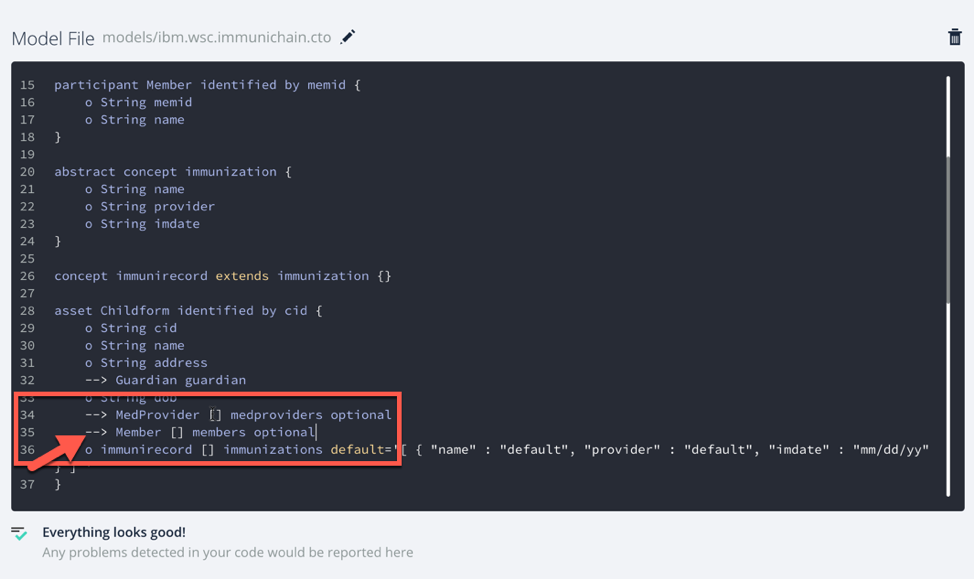

**4.** On line 47, add in this line in the transaction authMember::

  --> Member member

.. image:: Images/8.4.png

**5.** On line 53, add in this line in the transaction removeMemberAuth::

  --> Member member

.. image:: Images/8.5.png

**Note** What other participants or assets could you see being added the Immunichain Blockchain network? Collaborate with a few people around you to gather ideas. Later you can add these participants and assets to your network. 

Now, let’s add some transactions.

**6.** Switch to the Script File (.js) in the Define Section

.. image:: Images/8.6.png

**7.** Around line 20, add in this transaction::

  /**
 	* Authorize member to child record
  * @param {ibm.wsc.immunichain.authMember} authMember - the authMember transaction
 	* @transaction
 	*/
  function authMember(authMember) {
  	var guardian = authMember.guardian;
  	var child = authMember.childform;
  	var member = authMember.member;
  	child.members.push(member);
  	return getAssetRegistry('ibm.wsc.immunichain.Childform')
    	.then(function(ChildRegistry) {
    	return ChildRegistry.update(child);
  	});
  }

.. image:: Images/8.7.png

**8.** Around line 36, add in this transaction as well::

  /**
 	* Deauthorize member to child record, so remove from members list
  * @param {ibm.wsc.immunichain.removeMemberAuth} removeMemberAuth - the removeMemberAuth transaction
 	* @transaction
 	*/
  function removeMemberAuth(removeMemberAuth) {
	var guardian = removeMemberAuth.guardian;
	var child = removeMemberAuth.childform;
	var member = removeMemberAuth.member;
	var mem = child.members;
	var idx = mem.indexOf(member);

	//if the member is in the array of Members, we can remove it
	if (idx !== -1){
	mem.splice(idx,1);
	}

	return getAssetRegistry('ibm.wsc.immunichain.Childform')
	.then(function(result) {
	return result.update(child);
            });
  }

Look at the picture below to get a sense of what to do.

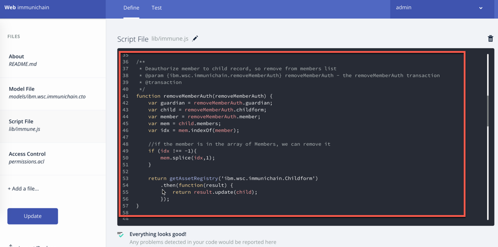

**9.** Click on Deploy Changes to update your business network. Due to 0.19.0 in Hyperledger Composer, you will get a pop up asking for an installation card and upgrade card. Choose the PeerAdmin@hlfv1 card and click upgrade. You will see this pop up every time you upgrade your chaincode version.

Part 6: Submitting Transactions
===============================

**1.** Now that we have a new participant type, let’s create one. Jump to the test section and click on Member on the left. 

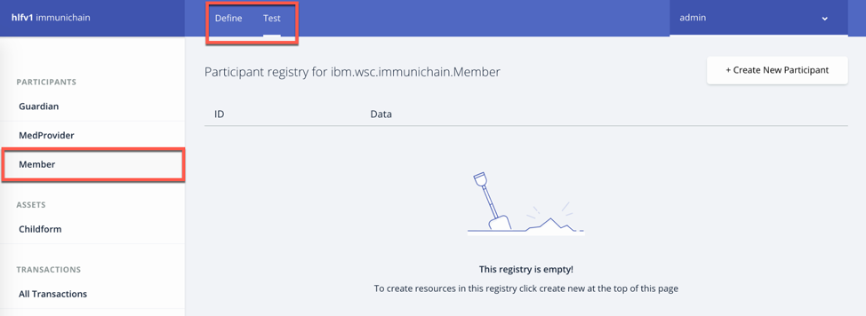

**2.** Click on Create New Participant and follow the steps below to add a Member.

.. image:: Images/9.2.png

**3.** Now that we have created a Member, let’s make some transactions. Click on Submit Transaction in the bottom left.

**4.** A pop-up will appear with the transaction of adding Immunizations in the grey box. Switch to assignMedProvider to assign a Medical Provider to one of the children you’ve created

**5.** Now, replace the ID Numbers to replicate the guardian, medical provider and child. Look at the below picture to get a sense of what to do

.. image:: Images/9.3.png

That basically says, assign medical provider #1 (Healthquest) to Child #1 (Emily).

**6.** Click Submit once you have the ID Numbers you want

**7.** Once you submit the transaction and it is good, click on All Transactions in the bottom left. This is what Composer likes to call the Historian. Now is a good time to tell you about the Historian. The Historian is the sequence of transactions or addition or removal of participants or assets. I didn’t tell you to look at the Historian when you were creating the Participants and assets, but the Historian kept track of when and what type of participant or asset you created. You can scroll to the bottom to view the first transaction you created, which should be the Medical Provider, HealthQuest or whatever you called it. You can see by clicking on view record. 

.. image:: Images/9.4.png

**8.** Back to our transaction, click on the Childform on the left. Find the child you assigned a Medical Provider to. Click on Show All to view the entire asset of your child. Notice the medical provider you assigned it to? 

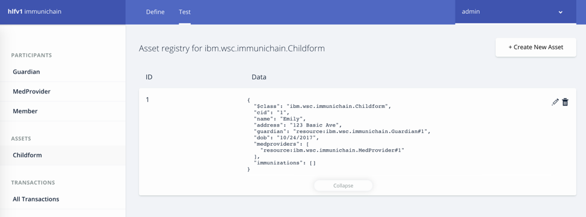

**9.** Should we do another transaction? Of course! This time we will add a member to our child. To do this, we need to go back to our Child. 

**10.** Then click on the pencil in the top right of our child’s box.

.. image:: Images/9.6.png

**11.** Click on Optional Properties. You will notice the member section appearing now. Then click on Update.

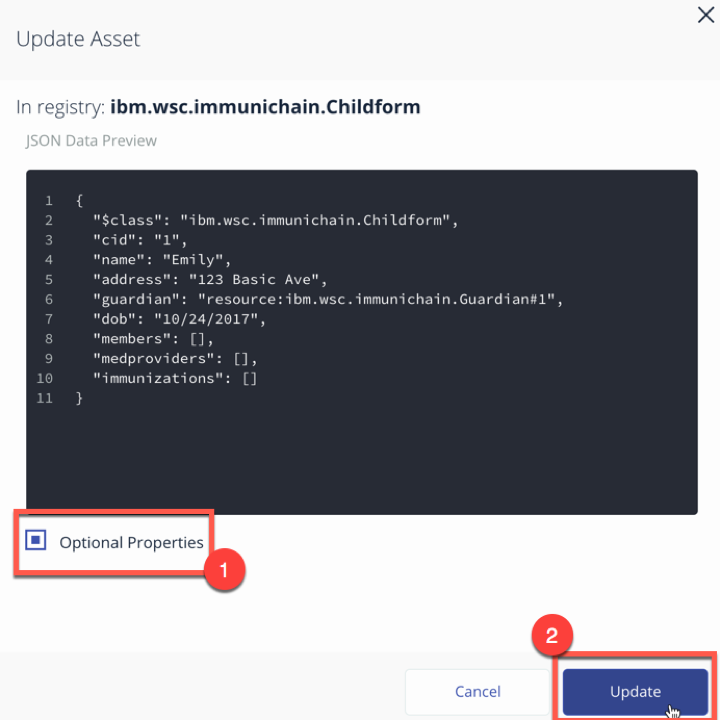

**12.** Now, click on Submit Transaction and let’s authorize a member to view the health record of our child. You can change the type of transaction you want by clicking on the middle grey box. 

**13.** Now, let’s make an authorized member transaction. Here is my transaction. You can make any type of transaction you want here

.. image:: Images/9.8.png

My transaction says let member #1 (High School) have Child #1’s (Emily) health record. This would be extremely useful when every year millions of kids get physicals in order to play a sport. Imagine having your medical provider authorize your child’s health record to approve them playing a sport. I know my mom would’ve enjoyed not going up to the High School an additional time. 

**14.** You can view this transaction by clicking on childform on the left and then Show All on Emily. Notice that member 1 is now in Emily’s description

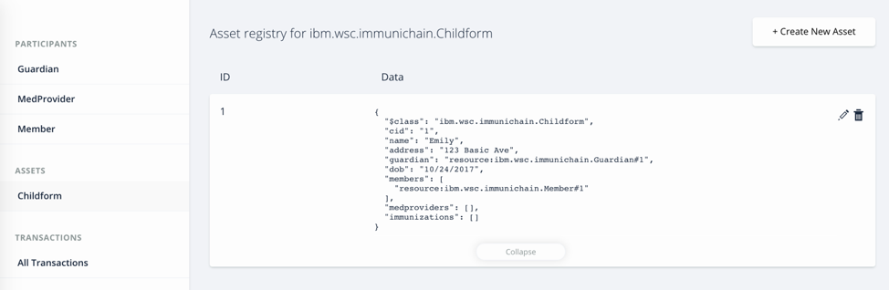

**15.** We have submitted some transactions, but now let’s actually add some immunizations to a child

**16.** Click on Submit Transaction and then change the transaction type to addImmunizations. The format to add an immunization is a little different. In the Vaccine section put { "name" : "immunization", "provider" : "medical provider", "imdate" : "date" } in-between the brackets. Replace the immunization, medical provider and date with whatever you would like. Here is what my transaction looks like::

  { "name" : "immunization", "provider" : "medical provider", "imdate" : "date" }

.. image:: Images/9.10.png

**17.** To view your immunization, go your child in the Childform section

.. image:: Images/9.11.png

**18.** Continue to make various transactions that you want
